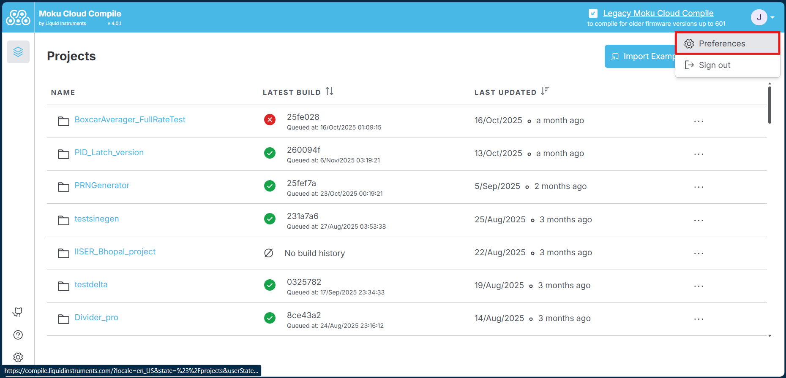
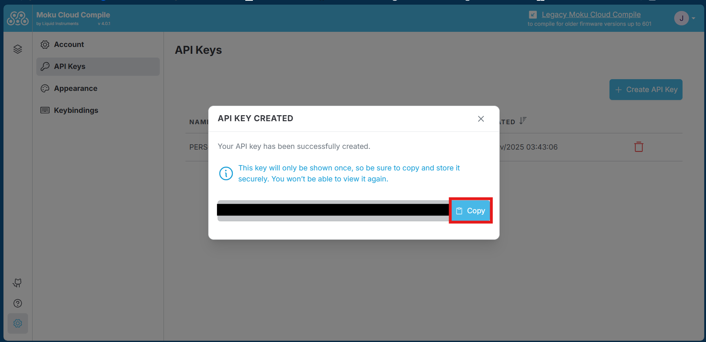
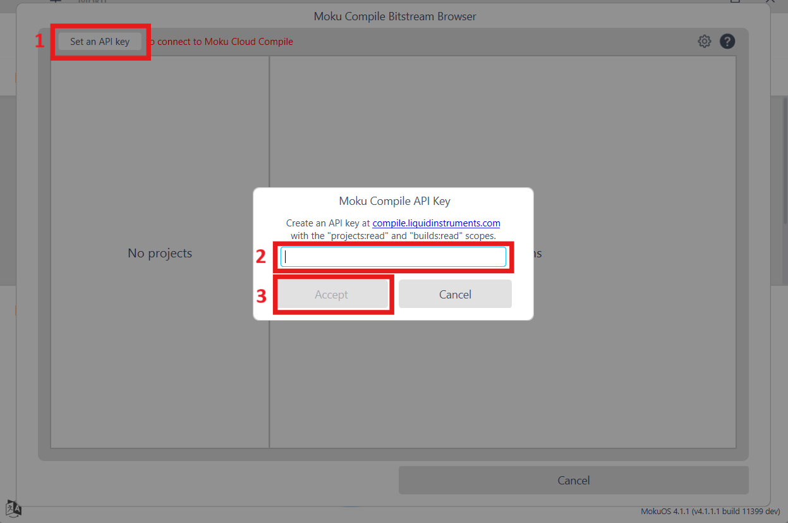
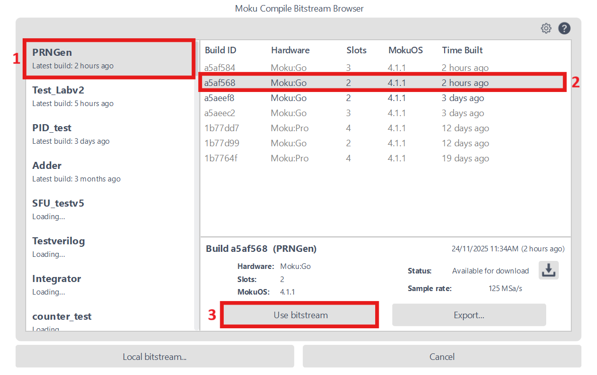

# Using Bitstream Browser

Instead of using the browser to download the bitstreams, you can use the Bitstream Browser embedded in the Moku application. This allows multiple devices to access the cloud server with the same account to download the required bitstreams. This is for Moku Cloud Compile and requires an Internet connection.

### Setting and Using API keys

**Step 1:** To use the Bitstream Browser, you need to first set up an API key on your Moku Cloud Compile account. Go to Cloud Compile website, and login to your account. After logging in, click on the top-right corner to access a drop-down menu and select Preferences.

**Step 2:** On the Preferences page, click on the "API Keys" tab to update the page. Click on Create API Key and fill in the name for the Key. Select the access you want with the API key. For use with Bitstream Browser, you would need to select "projects:read" and "builds:read".

**Step 3:** Once the key has been created, a dialog will show with the generated API key. Copy the key and save it for reference as it will not be accessible again. Save as a text file for use in the Bitstream Browser or share it within the devices using the same Moku Compile account.

**Step 4:** After the API key is created, we can add it to the browser. Open the Moku application, and navigate to the settings icon towards the lower right side. Select "Bitstreams" from the drop-down menu to open the Moku Compile Bitstream Browser window. Alternatively you can open this Browser when loading the bitstream into Custom Instrument as shown in [Deploying Your Design](./getting-started/deploying.md).

**Step 5:** Select "Set an API key" and paste the key that was copied earlier to load all the projects associated with the account and the bitstreams available on each project. Select the compatible bitstream to upload onto your Moku device.

