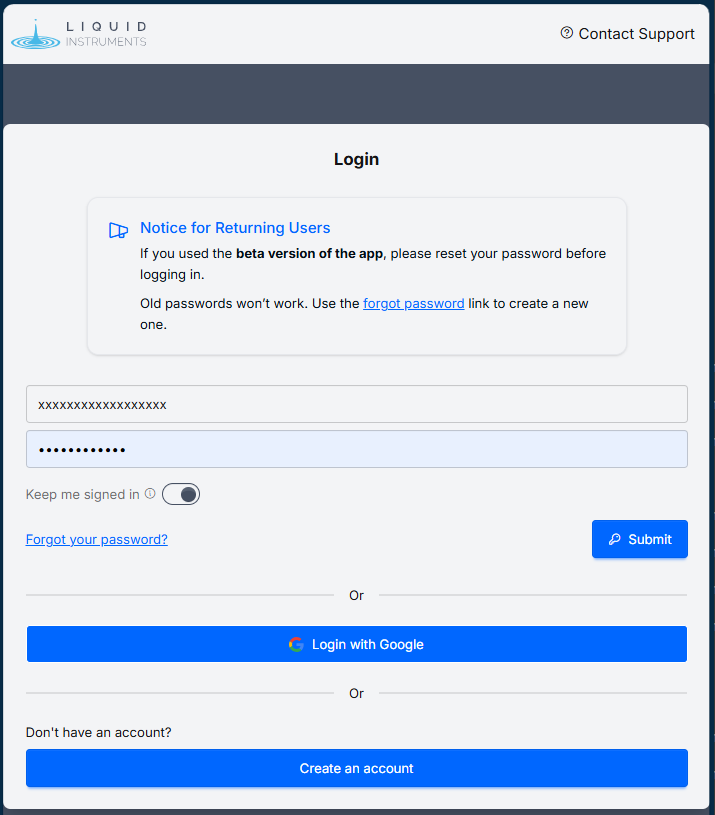
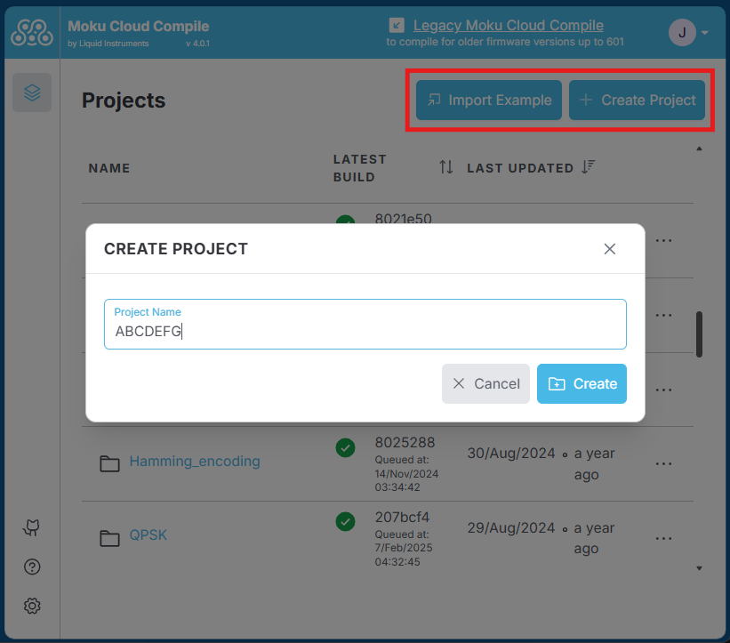
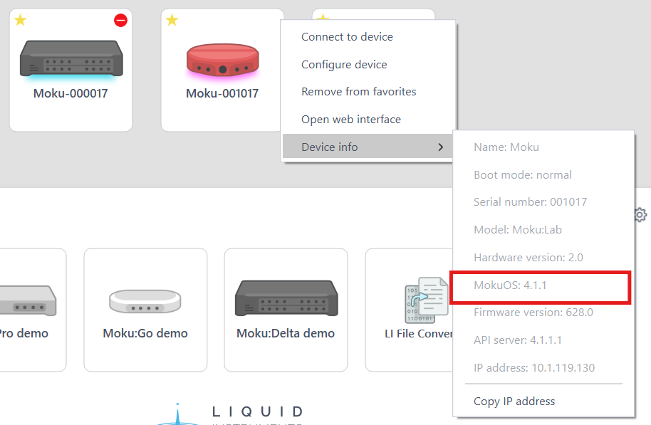

# Moku Cloud Compile
Moku Cloud Compile is a browser-based compilation service that allows users to develop their custom code using the Liquid Instruments servers. Projects and codes are stored securely on the Liquid Instruments servers. Users must have an internet connection to upload code, edit projects, and run compilations on the cloud server. After successful compilation, the bitstreams can be downloaded and deployed onto the Moku device via the Moku application or API.

All Moku Compile modules are either VHDL or Verilog entities that provide the Architecture of the custom entity. For examples of what this can look like, refer to the [examples](./../examples/basic.md) pages. Once you have such an entity, you need to build and deploy it to your Moku. This guide will show you how to create a project and build a bitstream for your device using Moku Cloud Compile.

### Logging into Moku Cloud Compile

Open your preferred web browser and go to Moku Cloud Compile webpage. Create an account or Log in with your existing credentials or through your Google account.

<action-button text="Login to Moku Cloud Compile" link="https://compile.liquidinstruments.com" target="_blank"/>

### Creating a project

Once you have signed in, you can access the various projects in your account. Click on "Create Project" in the top-right corner and type in a name to create a new project. Alternatively, you can create a project based on the existing examples by clicking on "Import Example".

### Find your MokuOS Version

To build your design, you must target a particular device. A device is a combination of hardware (e.g. Moku:Pro) and MokuOS (e.g. version 4.0.1). On the Desktop App, right-click your Moku, select `Device info` and note the **MokuOS version**. On iPad, you can see this information by long-pressing your device.

### Build your project

In your Moku Cloud Compile project:

1. Configure **Hardware version**, **Number of slots**, and **MokuOS version** (3 or 8 slots for Moku:Delta, 4 slots for Moku:Pro, and 2 or 3 slots for Moku:Go and Moku:Lab)
2. Create a new file as .vhd or .v file and start coding, or drag and drop the files directly into the project.
3. Build your project with the configured settings on Step 1.
4. Expand the build logs panel to view progress. When all indicators are green, click `bitstream.tar` to download the build artifact to deploy to your Moku.

Once the build is completed, you can access the generated bitstream and report detailing logs of the compilation process and resource utilization of the custom design. [Deploy the bitstream](./deploying.md) to your device and implement your custom design.

:::warning MokuOS and Slot Mismatch
Trying to deploy Moku Compile bitstream on a Moku with a different MokuOS version or number of slots to what it was built for can cause the Moku to hang, requiring a power cycle.
:::

The build time depends on the hardware platform and project complexity. A simple project on Moku:Go will build in 3-5 minutes while Moku:Pro designs may take up to half an hour.

::: tip Compatible MokuOS and Bitstream File Extension
The generated bitstreams will be either in **.tar** or **.tar.gz** depending on the target MokuOS. The extension **.tar** is for MokuOS versions 3.3.1 onwards. The extension **.tar.gz** is for older MokuOS versions from 3.0.0 to 3.2.0.
:::