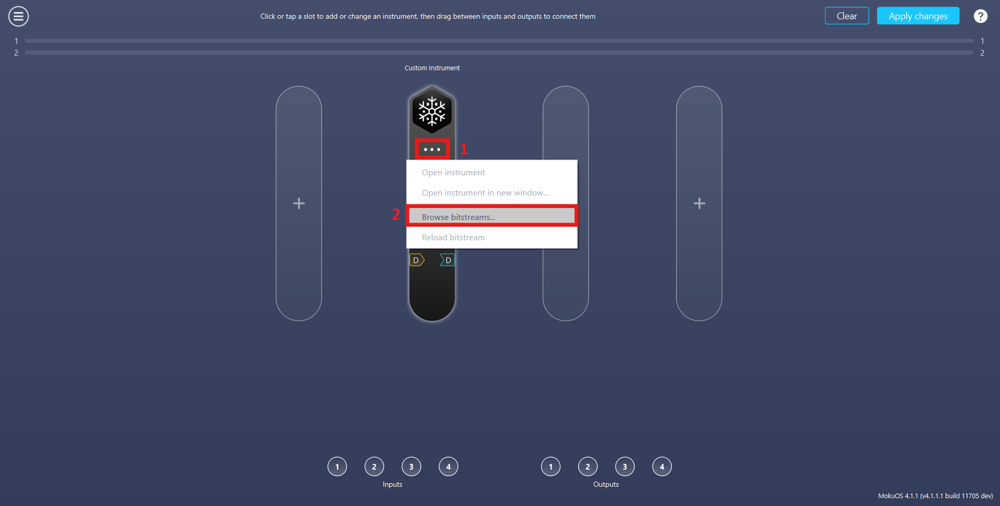
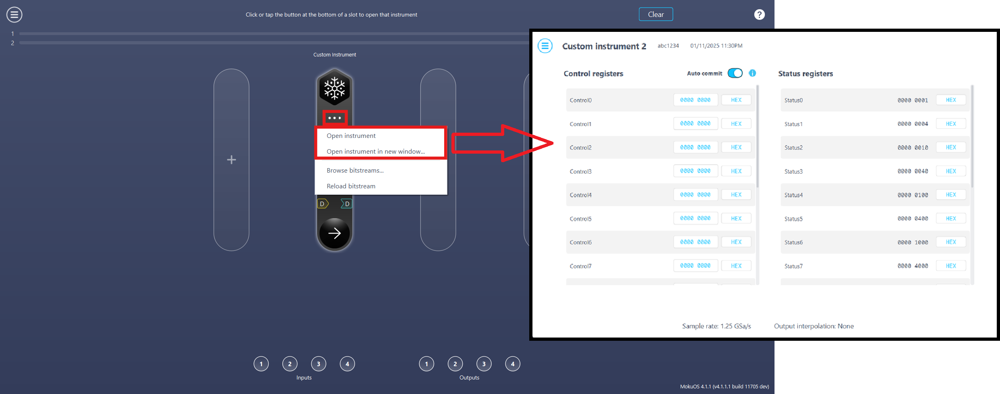
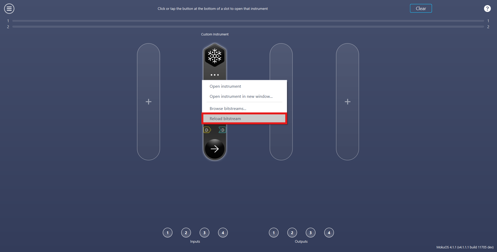

# Deploying Your Design

With your project bitstreams downloaded, the next step is to upload the design on to your Moku device. You can use either the Moku application interface as shown below or with API as shown in examples [here](./../../api/moku-examples/python-api/#moku-compile).

## Add Custom Instrument

Add at least one Custom Instrument to your Multi-Instrument Mode configuration

## Browse Bitstreams

The Custom Instrument requires a customized bitstream (ensure that the MokuOS version and slot number of the bitstreams matches your Moku device configuration). 

:::warning MokuOS and Slot Mismatch
Trying to deploy Moku Compile bitstream on a Moku with a different MokuOS version or number of slots to what it was built for can cause the Moku to hang, requiring a power cycle.
:::

The bitstream can be deployed by using the Bitstream Browser on the Moku application as shown below:

1. Click on the three-dot icon
2. Click on the **Browse bitstreams...** tab

The bitstream can either be [fetched from the Cloud server](../browser.md) or you can manually upload the downloaded bitstream using the following steps.

1. Click on the **Local bitstream...** to access the local file directory. 
2. Navigate to the required directory and select the correct bitstreams file
3. Click on the **Open** button
4. Click on the **Apply changes** button to deploy the bitstream.

## Running the Custom Instrument

Utilize the Multi-Instrument Mode configuration screen to connect your design with analog and digital connections, alongside with any additional instruments, as desired. Once the Custom Instrument is deployed, you can edit your design's Control registers or view the design's Status registers by clicking in to the Custom Instrument which would open the instrument. For more information, see [Control Registers](./../controls.md) and [Status Registers](./../statusregs.md). Note that with your bitstream now on your Moku device, your custom design can now be deployed in whichever slot you put the Custom Instrument in Multi-Instrument Mode. The same bitstream does not have to be uploaded again. 

## Reload Bitstreams

When swapping the customized Moku Compile bitstreams, it's possible that the bitstreams running on the internal FPGA may differ from those you uploaded to your Moku. This occurs because the bitstreams are uploaded but the internal FPGA isn't refreshed. To ensure that the Custom Instrument running on the FPGA is up to date, please click on the **Reload bitstream** tab.

