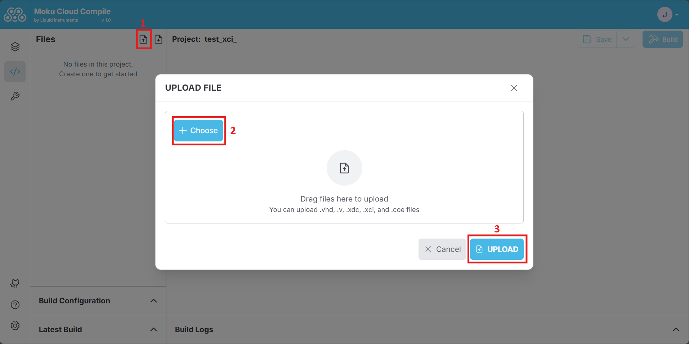

# IP Core support

Moku Compile also supports the inclusion of IP cores in your custom designs. These IP cores can be selected from our library of pre-compiled IP cores with the flexibility to add your own customized IP core from AMD Xilinx™.

## Pre-compiled IP Cores

The Moku library consists of eight pre-compiled IP cores optimized for arithmetic, filtering, waveform generation, and correlation analysis, all fully compatible with Moku:Go, Moku:Lab, Moku:Pro, and Moku:Delta hardware. These cores can be instantiated either in your VHDL or Verilog codes and simplify common digital signal processing tasks in your customized code. The supported IP cores are as follows:

| Supported AMD IP Core | Description | Template and Example |
|-----------------------|-------------| :------------------: |
| Adder/Subtractor <small><br> [Adder/subtractor v12.0](https://docs.amd.com/v/u/en-US/pg120-c-addsub) </br></small>         | Add or Subtract two numbers                                  |  <action-button text="Adder/Subtractor" link="https://github.com/liquidinstruments/moku-examples/tree/main/mc/IP%20Core%20Templates%20and%20Examples/Adder_Subtractor" target="_blank"/>  |
| CIC Decimation (by 8) <small><br> [CIC compiler v4.0](https://docs.amd.com/v/u/en-US/pg140-cic-compiler) </br></small>     | Decimate the input data by a factor of 8                     |    <action-button text="CIC Decimation" link="https://github.com/liquidinstruments/moku-examples/tree/main/mc/IP%20Core%20Templates%20and%20Examples/CICDec_3Ord_x8" target="_blank"/>    |
| CORDIC Transformation <small><br> [CORDIC v6.0](https://docs.amd.com/v/u/en-US/pg105-cordic) </br></small>                 | Use CORDIC computation for rectangular to polar conversion   |   <action-button text="CORDIC" link="https://github.com/liquidinstruments/moku-examples/tree/main/mc/IP%20Core%20Templates%20and%20Examples/CORDIC%20Transformation" target="_blank"/>    |
| Counter (32-bit) <small><br> [Binary Counter v12.0](https://docs.amd.com/v/u/en-US/pg121-c-counter-binary) </br></small>   | A binary counter that counts on every clock tick             |       <action-button text="Counter" link="https://github.com/liquidinstruments/moku-examples/tree/main/mc/IP%20Core%20Templates%20and%20Examples/Counter(32-bit)" target="_blank"/>       |
| FFT (1024 points) <small><br> [Fast Fourier Transform Core v9.1](https://docs.amd.com/r/en-US/pg109-xfft) </br></small>    | Performs a Fast Fourier Transform of 1024-points data frame  |                <action-button text="FFT 1024" link="https://github.com/liquidinstruments/moku-examples/tree/main/mc/IP%20Core%20Templates%20and%20Examples/FFT%20(1024)"/>                |
| FFT (65536 points) <small><br> [Fast Fourier Transform Core v9.1](https://docs.amd.com/r/en-US/pg109-xfft) </br></small>   | Performs a Fast Fourier Transform of 65536-points data frame |       <action-button text="FFT 65536" link="https://github.com/liquidinstruments/moku-examples/tree/main/mc/IP%20Core%20Templates%20and%20Examples/FFT%20(65536)" target="_blank"/>       |
| FIR filter (7 coefficients) <small><br> [FIR compiler v7.2](https://docs.amd.com/r/en-US/pg149-fir-compiler) </br></small> | Generates a FIR filter with 7 taps                           | <action-button text="FIR Filter" link="https://github.com/liquidinstruments/moku-examples/tree/main/mc/IP%20Core%20Templates%20and%20Examples/FIR%20(7%20coefficients)" target="_blank"/> |
| Sine Generator (48-bit) <small><br> [DDS Compiler v6.0](https://docs.amd.com/r/en-US/pg141-dds-compiler) </br></small>     | Generates a sine wave that takes in a 48-bit frequency       |     <action-button text="Sine Gen" link="https://github.com/liquidinstruments/moku-examples/tree/main/mc/IP%20Core%20Templates%20and%20Examples/SineGen%20(48-bit)" target="_blank"/>     |

An example is shown below to use the Adder IP Core

<code-group>

<code-block title="VHDL">

```vhdl
architecture Behavioural of CustomWrapper is
begin
    A1 : AddSubtract_16
  PORT MAP (
    A => InputA,
    B => InputB,
    CLK => Clk,
    ADD => Control0(31),
    CE => '1',
    S => OutputA
  );
end architecture;
```

</code-block>

<code-block title="Verilog">

```verilog
module CustomWrapper (
    input wire Clk,
    input wire Reset,
    input wire [31:0] Sync,

    input wire signed [15:0] InputA,
    input wire signed [15:0] InputB,
    input wire signed [15:0] InputC,
    input wire signed [15:0] InputD,

    input wire ExtTrig,

    output wire signed [15:0] OutputA,
    output wire signed [15:0] OutputB,
    output wire signed [15:0] OutputC,
    output wire signed [15:0] OutputD,

    output wire OutputInterpA,
    output wire OutputInterpB,
    output wire OutputInterpC,
    output wire OutputInterpD,

    input wire [31:0] Control0,
    input wire [31:0] Control1,
    input wire [31:0] Control2,
    input wire [31:0] Control3,
    input wire [31:0] Control4,
    input wire [31:0] Control5,
    input wire [31:0] Control6,
    input wire [31:0] Control7,
    input wire [31:0] Control8,
    input wire [31:0] Control9,
    input wire [31:0] Control10,
    input wire [31:0] Control11,
    input wire [31:0] Control12,
    input wire [31:0] Control13,
    input wire [31:0] Control14,
    input wire [31:0] Control15
);
 AddSubtract_16 A1(
  .A(InputA),
  .B(InputB),
  .CLK(Clk),
  .ADD(Control0[31]),
  .CE(1'b1),
  .S(OutputA)
);
endmodule
```

</code-block>

</code-group>

The instantiation templates for the IP cores are available in the [GitHub repository](https://github.com/liquidinstruments/moku-examples/tree/main/mc/IP%20Core%20Templates%20and%20Examples) with support for both VHDL and Verilog.

## Uploading your own IP core (using .xci file)

Users can also add their own IP cores that are generated from AMD Xilinx Vivado™ and utilize them in Moku Compile to build their customized logic. This can be done by uploading an **.xci** file that holds information of the desired IP core. Note that this requires the user to be using the Vivado software with the key FPGA part as shown in the Table.

| Hardware platform | FPGA model number |
|----------------|------------|
| Moku:Go        | xc7z020clg400-1 |
| Moku:Lab       | xc7z020clg484-3 |
| Moku:Pro       | xczu9egffvc900-2 |
| Moku:Delta     | xczu47dr-fsvg1517-2-e |

:::warning Vivado™ compatibility
When generating the **.xci** file of your IP cores, please use Vivado 2022.2™. Using an **.xci** file from any other version of Vivado software can result in a failed synthesis.
:::

The below steps encapsulate the process of obtaining the necessary files from Xilinx Vivado™ to deploying on the Moku.

**Step 1:** In the Project Manager of Vivado, select the IP Catalog and choose the desired IP core. Set the parameters for the IP core and generate outputs. After clicking on the Generate outputs prompt, the sources will be updated with the corresponding **.xci** file with details on the file location in the Properties tab.


**Step 2:** Add the XCI file with the IP name to your Moku Compile project. The files can be found in the Xilinx project directory as shown in the previous step.

Upload the XCI file with the IP name found in the last step, i.e. "xbip_multadd_0.xci", and if applicable the coefficient file, i.e. "xbip_multadd_0.coe", to your Moku Compile project.



**Step 3:** Change the output directory of your IP core by editing the XCI file.

After uploading the file, edit the XCI file, i.e. "xbip_multadd_0.xci", by locating `"OUTPUTDIR"` and change the value to `"../output"`.


<u>*Optional Step:*</u> If the IP core utilizes user-defined coefficients using a COE file, an additional change may be required. Edit the XCI file by locating `"Coe_File"` and change the value to `"Coe_filename.coe"`, without any additional directory path.


**Step 4:** Vivado also generates **.vho** or **.veo** files (found within the IP sources tab in Sources on Vivado) from which the instantiation template can be obtained. Use this template to assist you in including your IP core in your customized logic in Moku Compile project.


**Step 5:** Choose the build configuration (hardware platform, number of slots and MokuOS version) and start the build process. The process will then generate the bitstream that can then be deployed onto the Moku in the Custom Instrument slot.
