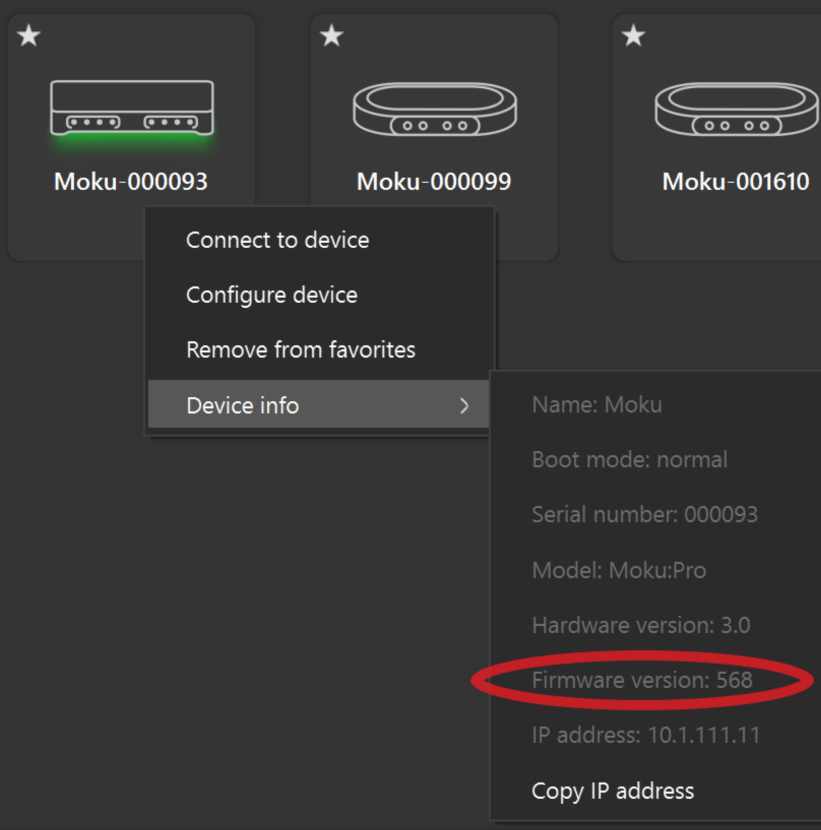
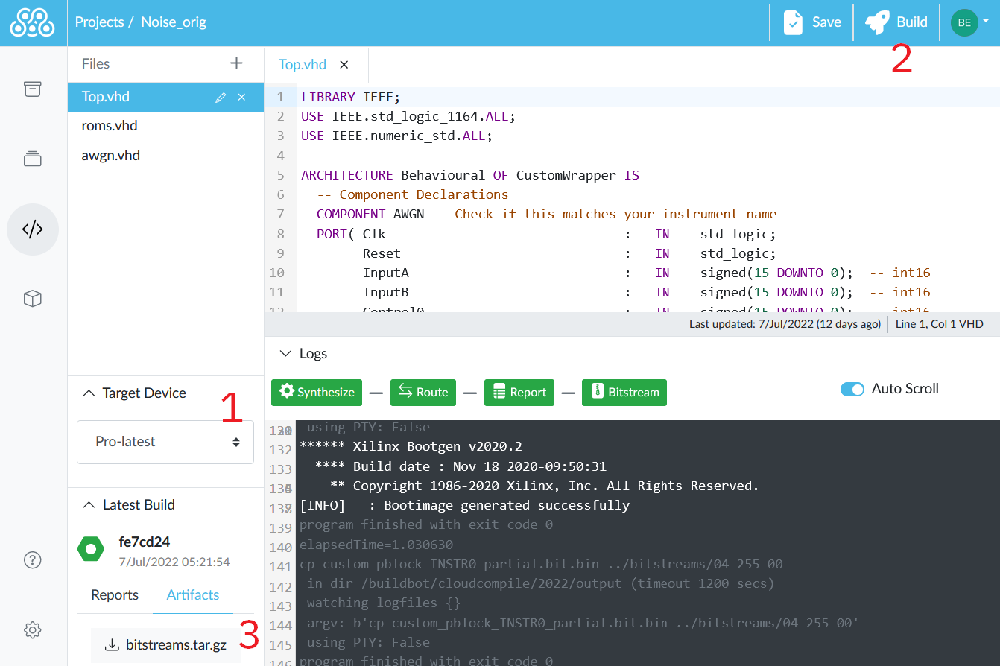
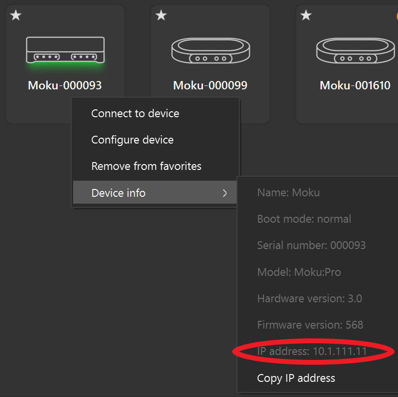
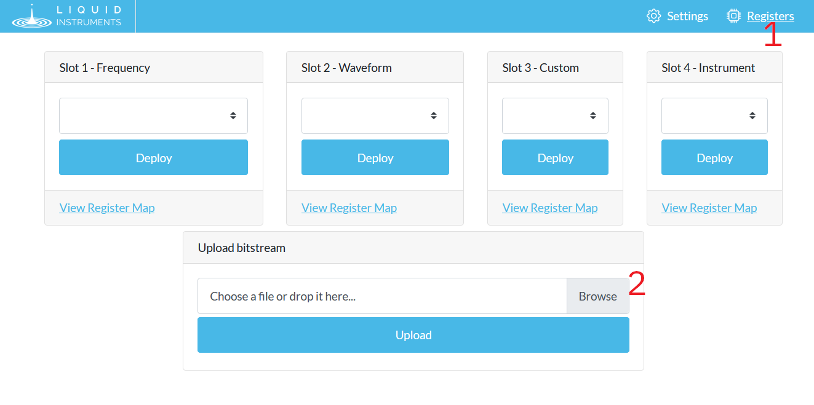
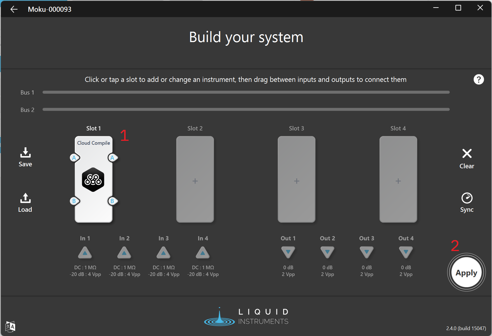

# Deploying Your Design

All Moku Cloud Compile (MCC) modules are just VHDL entities that provide the Architecture of the CustomWrapper entity. For examples of what this can look like, refer to the [examples](examples/) pages.

Once you have such an entity, you need to deploy it to your Moku. This guide will show you how.

:::tip MCC Beta
MCC is currently in Open Beta. The workflow below will change as the product approaches a full release. If you find any inconsistencies in this documentation, please ensure that your Moku Application (desktop and/or iPad) is up to date, then reach out to [Liquid Instruments Support](mailto:support@liquidinstruments.com).
:::

## Building

To build your design, you must target a particular device. A device is a combination of hardware (e.g. Moku:Pro) and firmware (e.g. version 568).

### Find your Firmware Version

On the Desktop App, right-click your Moku, select `Device Info` and note the Firmware Version. On the iPad, you can see this information by long-pressing your device.

### Create or Update your Device

On the Devices screen, add a new device or edit an existing one. The hardware and firmware versions must match those on your Moku exactly.

:::warning Firmware Mismatch
Trying to deploy an MCC design on a Moku with a different firmware version to that for which it was built can cause the Moku to hang, requiring a power cycle.
:::

### Build your Design

In your MCC project:

1. Select your newly-created device in the Target drop-down
2. Build your project
3. Expand the logs panel to view progress. When all indicators are green, click `bitstream.tar.gz` to download the build artifact to deploy to your Moku

The build time depends on the hardware platform and project complexity. A simple project on Moku:Go will build in 3-5 minutes while Moku:Pro designs may take up to half an hour.

## Deploying

With your build downloaded, the next step is to upload the design on to your Moku. The easiest way to do this is to use the Moku's built-in web interface.

### Find your IP Address

The Moku's IP address is on the same screen as its firmware version, see above.

### Upload in Moku's Web Interface

Navigate to that IP address in your browser. For example, if you found your Moku's IP was `10.1.111.11` then visit `http://10.1.111.11`.

1. Select `Registers` in the top-right. Your screen may differ, depending what is currently running on your Moku.
2. Upload your MCC Design file in the Upload bitstream box.

:::warning IPv6
Note that this step requires that you visit your Moku's control interface in a browser. Limitations of modern browsers mean that this is not possible if you're using IPv6 "Link Local" addresses, including for example if you're connecting to your Moku over USB. For more information and possible solutions, see [the API documentation](https://apis.liquidinstruments.com/ip-address.html#ipv6)
:::

### Deploy in Multi-Instrument Mode

With your design now on your Moku, your design will now be deployed whenever you put a "Cloud Compile" instrument in a slot in Multi-instrument Mode (MiM). Use the MiM configuration screen to deploy your design alongside any other instruments that may be required. You can also use this screen to configure routing between your MCC design and other instruments and/or the physical BNC connectors on your Moku.

1. Add at least one Cloud Compile instrument to your MiM configuration
2. Apply the settings to start your design running

Once the MiM configuration is applied, you can edit your design's Control Registers by clicking in to the deployed Cloud Compile instrument. For more information, see [Control Registers](controls.md).

