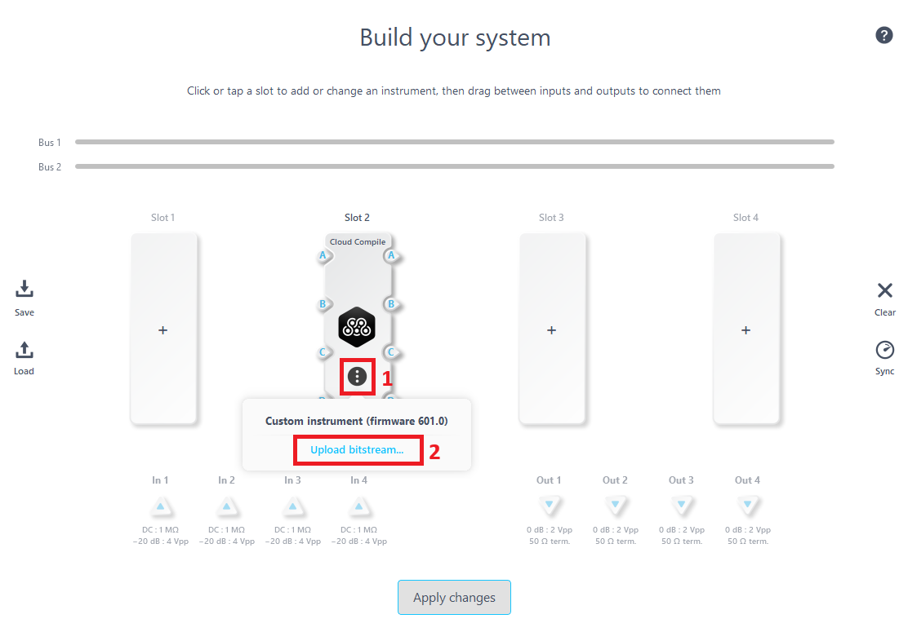
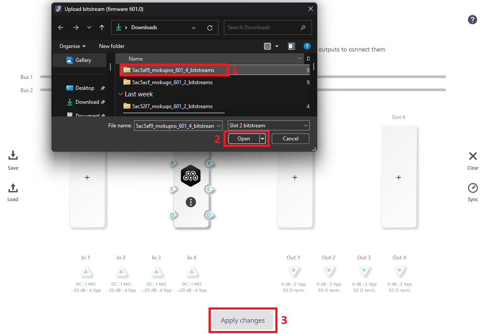
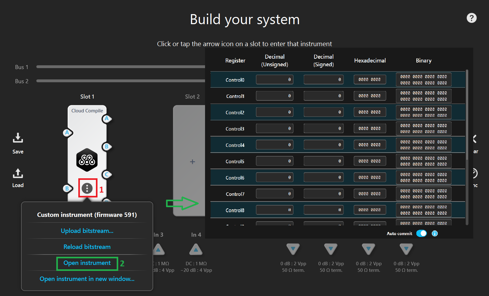
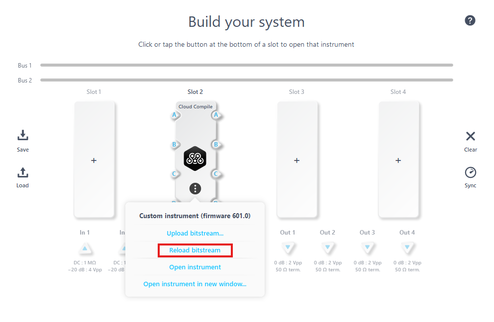

# Deploying Your Design

All Moku Cloud Compile (MCC) modules are just VHDL entities that provide the Architecture of the CustomWrapper entity. For examples of what this can look like, refer to the [examples](./examples/basic) pages.

Once you have such an entity, you need to deploy it to your Moku. This guide will show you how.

## Building

To build your design, you must target a particular device. A device is a combination of hardware (e.g. Moku:Pro) and firmware (e.g. version 591).

### Find your Firmware Version

On the Desktop App, right-click your Moku, select `Device Info` and note the **Firmware version**. On the iPad, you can see this information by long-pressing your device.

### Build your Design

In your MCC project:

1. Configure **Hardware version**, **No# of slots**, and **Firmware version** (4 slots for Moku:Pro, and 2 slots for Moku:Go and Moku:Lab)
2. Build your project
3. Expand the logs panel to view progress. When all indicators are green, click `bitstream.tar` to download the build artifact to deploy to your Moku

:::warning Firmware Mismatch
Trying to deploy an MCC design on a Moku with a different firmware version to that for which it was built can cause the Moku to hang, requiring a power cycle.
:::

The build time depends on the hardware platform and project complexity. A simple project on Moku:Go will build in 3-5 minutes while Moku:Pro designs may take up to half an hour.

## Deploying

With your build downloaded, the next step is to upload the design on to your Moku. The easiest way to do this is to use the Moku: App interface, but the Moku's integrated web interface is also a viable option.

### Use Moku: App Interface (for Moku: app version 3.1 or newer)

#### Add Cloud Compile Instrument

Add at least one Cloud Compile instrument to your Multi-instrument Mode (MiM) configuration to activate the capability of running Cloud Compile on your device.

1. Click on the three-dot icon
2. Click on the **Upload bitstream** tab

#### Upload Bitstreams

The Cloud Compile instrument requires a customized bitstream (please ensure that the firmware version of the bitstreams matches your Moku device), which can be uploaded by following these steps.

1. Select the correct bitstreams file
2. Click on the **Open** button
3. Click on the **Apply changes** button

#### Deploy Cloud Compile Instrument

Now that your design is on your Moku, it's ready to be deployed. Utilize the MiM configuration screen to deploy your design along with any additional instruments that may be necessary. This screen allows you to set up routing between your MCC design, other instruments, and the physical input/output ports on your Moku.

Once the MiM configuration is applied, you can edit your design's Control Registers by clicking in to the deployed Cloud Compile instrument. For more information, see [Control Registers](controls.md).

#### Reload Bitstreams

When swapping the customized Cloud Compile bitstreams, it's possible that the bitstreams running on the internal FPGA may differ from those you uploaded to your Moku. This occurs because the bitstreams are uploaded but the internal FPGA isn't refreshed. To ensure that the Cloud Compile instrument running on the FPGA is up to date, please click on the **Reload bitstream** tab.

### Use Moku's Web Interface

#### Find your IP Address

To find the IPv4 address, please follow these steps.

1. Right-click on the device icon, and select **Configure device**
2. Look for the IPv4 address under the tab of the connection being used

#### Upload in Moku's Web Interface

Navigate to that IP address in your browser. For example, if you found your Moku's IP was `192.168.2.31` then visit `http://192.168.2.31`.

1. Select `Registers` in the top-right. Your screen may differ, depending what is currently running on your Moku.
2. Upload your MCC Design file in the Upload bitstream box.

:::warning IPv6
Note that this step requires that you visit your Moku's control interface in a browser. Limitations of modern browsers mean that this is not possible if you're using IPv6 "Link Local" addresses, including for example if you're connecting to your Moku over USB. For more information and possible solutions, see [the API documentation](https://apis.liquidinstruments.com/ip-address.html#ipv6)
:::

#### Deploy in Multi-instrument Mode

With your design now on your Moku, your design will now be deployed whenever you put a "Cloud Compile" instrument in a slot in Multi-instrument Mode (MiM). Use the MiM configuration screen to deploy your design alongside any other instruments that may be required. You can also use this screen to configure routing between your MCC design and other instruments and/or the input/output ports on your Moku.

1. Add at least one Cloud Compile instrument to your MiM configuration
2. Apply the settings to start your design running

Once the MiM configuration is applied, you can edit your design's Control Registers by clicking in to the deployed Cloud Compile instrument. For more information, see [Control Registers](controls.md).

