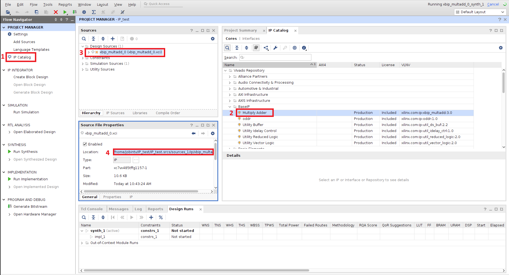
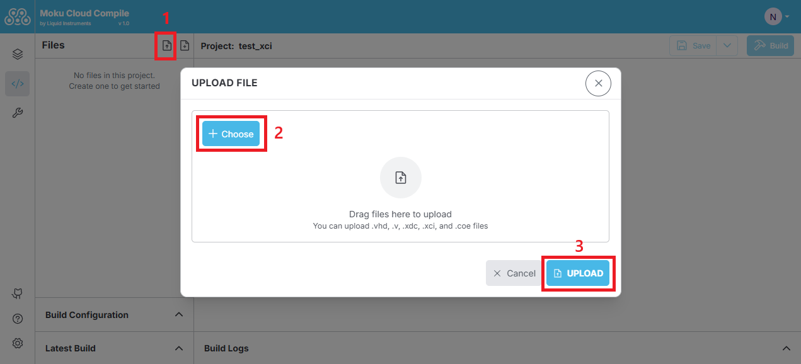
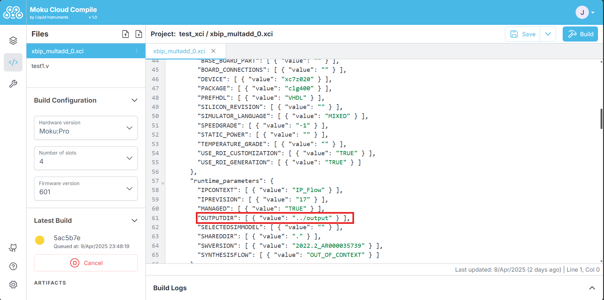
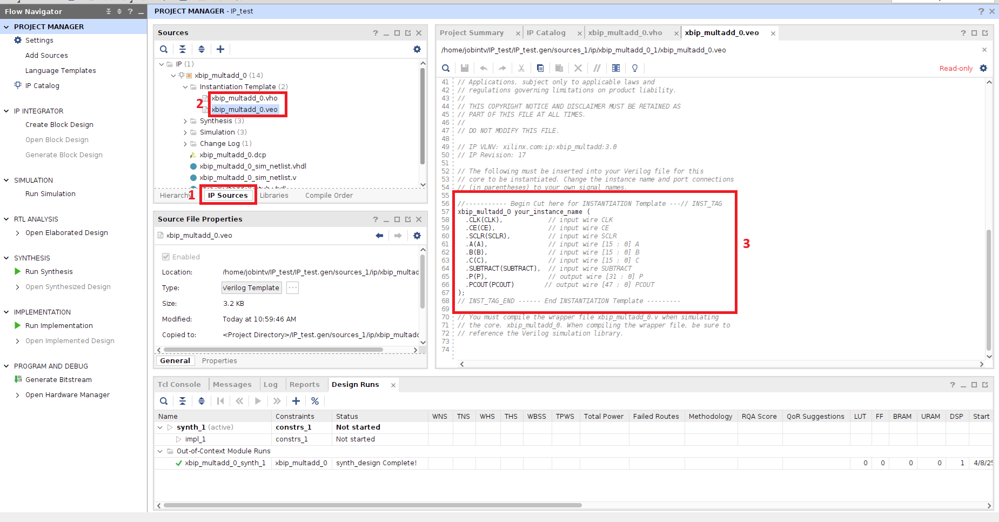

# IP Core support

Moku Cloud Compile now supports the incorporation of Xilinx IP Cores into your custom design. This update adds eight pre-compiled IP cores optimized for arithmetic, filtering, waveform generation, and correlation analysis, all fully compatible with Moku:Go, Moku:Lab, and Moku:Pro hardware. These cores are ready to instantiate and simplify common digital signal processing tasks.
These IP cores can be instantiated either in your VHDL or Verilog codes and ease your time to write your customized blocks. The supported IP cores are as follows:

|     IP Core        | Description      | Reference Link   |
|-------------|-----------------|-----------------|
| Adder/Subtractor       | Add or Subtract two numbers | [Adder/subtractor v12.0](https://docs.amd.com/v/u/en-US/pg120-c-addsub) |
| CIC Decimation (by 8)  | Decimate the input data by a factor fo 8 |[CIC compiler v4.0](https://docs.amd.com/v/u/en-US/pg140-cic-compiler) |
| CORDIC Transformation  | Use CORDIC computation for rectangular to polar conversion |  [CORDIC v6.0](https://docs.amd.com/v/u/en-US/pg105-cordic) |
| Counter (32-bit)          | A binary counter that counts on every clock tick |            [Binary Counter v12.0](https://docs.amd.com/v/u/en-US/pg121-c-counter-binary) |
| FFT (1024 points) | Performs a Fast Fourier Transform of 1024-points data frame| [Fast Fourier Transform Core v9.1](https://docs.amd.com/r/en-US/pg109-xfft)|
| FFT (65536 points)   | Performs a Fast Fourier Transform of 65536-points data frame | [Fast Fourier Transform Core v9.1](https://docs.amd.com/r/en-US/pg109-xfft)|
| Sine Generator (48-bit) | Generates a sine wave that takes in a 48-bit frequency | [DDS Compiler v6.0](https://docs.amd.com/r/en-US/pg141-dds-compiler)|
| FIR filter (7 coefficients) | Generates a FIR filter with 7 taps | [FIR compiler v7.2](https://docs.amd.com/r/en-US/pg149-fir-compiler)|

An example is shown below to use the Adder IP Core

<code-group>

<code-block title="VHDL">

```vhdl
architecture Behavioural of CustomWrapper is
begin
    A1 : AddSubtract_16
  PORT MAP (
    A => InputA,
    B => InputB,
    CLK => Clk,
    ADD => Control0(31),
    CE => '1',
    S => OutputA
  );
end architecture;
```

</code-block>

<code-block title="Verilog">

```verilog
module CustomWrapper (
    input wire Clk,
    input wire Reset,
    input wire [31:0] Sync,

    input wire signed [15:0] InputA,
    input wire signed [15:0] InputB,
    input wire signed [15:0] InputC,
    input wire signed [15:0] InputD,

    input wire ExtTrig,

    output wire signed [15:0] OutputA,
    output wire signed [15:0] OutputB,
    output wire signed [15:0] OutputC,
    output wire signed [15:0] OutputD,

    output wire OutputInterpA,
    output wire OutputInterpB,
    output wire OutputInterpC,
    output wire OutputInterpD,

    input wire [31:0] Control0,
    input wire [31:0] Control1,
    input wire [31:0] Control2,
    input wire [31:0] Control3,
    input wire [31:0] Control4,
    input wire [31:0] Control5,
    input wire [31:0] Control6,
    input wire [31:0] Control7,
    input wire [31:0] Control8,
    input wire [31:0] Control9,
    input wire [31:0] Control10,
    input wire [31:0] Control11,
    input wire [31:0] Control12,
    input wire [31:0] Control13,
    input wire [31:0] Control14,
    input wire [31:0] Control15
);
 AddSubtract_16 A1(
  .A(InputA),
  .B(InputB),
  .CLK(Clk),
  .ADD(Control0[31]),
  .CE(1'b1),
  .S(OutputA)
);
endmodule
```

</code-block>

</code-group>

These examples are also available in the [GitHub repository](https://github.com/liquidinstruments/moku-examples/tree/main/mcc/) with the template for instantiating the module in either Verilog or VHDL.

## XCI file extension

In addition to the IP core library we provide, users can now add their own IP cores that are generated from AMD Xilinx Vivado and thus provides additional pathway to combine customized logic. Note that this requires the user to be using the Vivado software with the key FPGA part as shown in the Table.

| Hardware platform | FPGA model number |
|----------------|------------|
| Moku-Go        | xc7z020clg400-1 |
| Moku-Lab       | xc7z020clg484-3 |
| Moku-Pro       | xczu9egffvc900-2 |

The below steps encapsulate the process of obtaining the necessary files from Xilinx Vivado to deploying on the Moku.

**Step 1:** In the Project Manager of Vivado, select the IP Catalog and choose the desired IP core. Set the parameters for the IP core and generate outputs. After clicking on the Generate outputs prompt, the sources will be updated with the corresponding **.xci** file with details on the file location in the Properties tab.



**Step 2:** Upload the XCI file with the IP name found in the last step, i.e. **xbip_multadd_0.xci**, and if applicable the coefficient file, i.e. **xbip_multadd_0.coe**, to your Cloud Compile project. These files can be found in the project directory as shown in the previous step.



**Step 3:** After uploading the file, edit the XCI file, i.e. **xbip_multadd_0.xci**, by locating `"OUTPUTDIR"` and change the value to `"../output"`.



**Step 4:** Vivado also generates **.vho** or **.veo** files (found within the IP sources tab in Sources on Vivado) from which the instantiation template can be obtained. Use this template to assist you in including your IP core in your customized logic in Cloud Compile project.



**Step 5:** Choose the build configuration (hardware platform, number of slots and firmware version) and start the build process. The process would then generate the bitstream that can then be deployed on to the Moku on the Cloud Compile slot.
