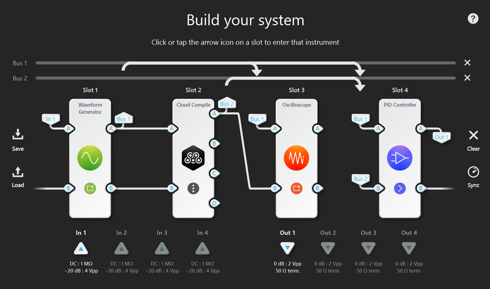

# Multi-Instrument and Slots

With the introduction of Multi-Instrument mode in Moku the FPGA has
been divided into isolated regions we call 'slots'. Each slot can be configured
with an instrument such as an Oscilloscope or Waveform Generator which will run
simultaneously and independendently. Slots can also be reconfigured to change
their function without interrupting instruments running in other slots.

Each slot has several input and output ports which can be routed to or from
various other locations. These sources can be the outputs of others slots or
the physical ADCs of the Moku. Signals can be routed to other slots or to
the DAC outputs of the Moku.

Multi-Instrument mode allows users of the Moku to build complete systems
consisting of several instruments in flexible configurations to meet the signal
processing requirements of their experiment. All of this is configurable using
the Moku Application.

With the addition of the Moku Cloud Compiler, users can now include their own
custom functionality in a multi-instrument configuration. This drastically
increases the flexibility and utility of the Moku as an experimentation and
system control platform.

## Slot Resources

The FPGA resources are divided between slots and the supporting logic in the
platform surrounding the slots.  The table below summarizes the resources availble
to a custom design in each slot.

|             | Moku:Pro (ZU9EG) | Moku:Go (ZC7020) | Moku:Lab (ZC7020) |
|-------------|-----------------:|-----------------:|------------------:|
|             |          4 Slots |          2 Slots |           2 Slots |
| Core Clock  |         312.5MHz |         31.25MHz |            125MHz |
| LUT         |            48400 |            20000 |             19600 |
| FF          |            96800 |            40000 |             39200 |
| BRAM (36K)  |              154 |               50 |                60 |
| DSP         |              432 |              100 |               100 |
