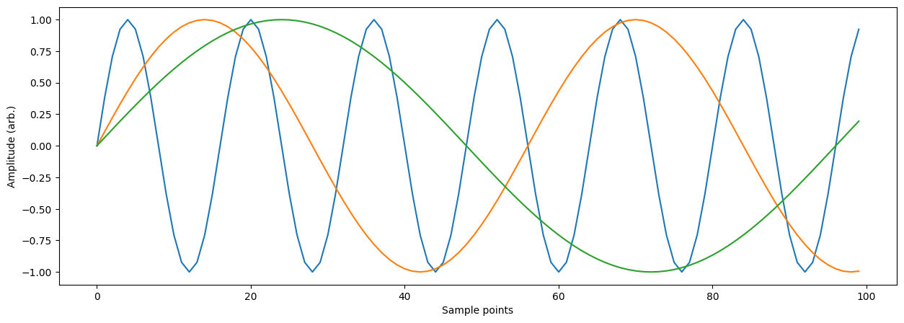
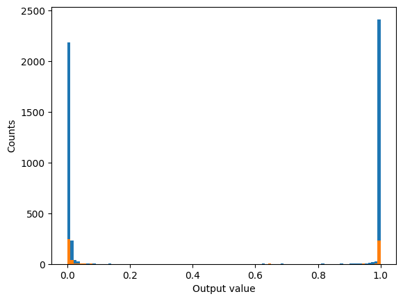

# Classifier example

One of the most common uses for neural networks is as a classifier, where input data is mapped to a series of classes, usually as a probability distribution. This is particularly useful if we have access to a number of examples of a particular class, for example a series of images that contain cats and a series of images that do not contain any cats. In this case it is clear to see that defining a closed form expression for whether an image contains a cat would be difficult, thus we wish to implicitly learn the relationship from the data.

In this example, we will construct a network that is looking to classify whether a particular type of anomaly is occurring in our signal of interest. The likelihood of the signal occurring in the dataset will be mapped to a single output, where a higher value indicates a higher likelihood of the anomaly having occurred. 


```python
# import the relevant libraries
import numpy as np
import matplotlib.pyplot as plt
import itertools
from tqdm import tqdm

from moku.nn import LinnModel, save_linn
# set the seed for repeatability
np.random.seed(42)
```

# Data generation

For this example, we will use the serial input mode of the neural network instrument. This mode corresponds to taking a rolling window of points from a single input channel which are fed into the model as a single input vector. The maximum input size we can take is a vector of length 100, thus, we will generate a series of signals of length 100. The anomaly that we will try to classify will look like a plateau in an otherwise periodic signal with some noise. 

We will start by generating a series of clean signals that we will inject random anomalies into.


```python
# length of the input signal
N = 100

# time series over which to define the signals
T = np.array([t for t in range(N)])

# a range of phases and frequencies to generate signals over
P = [2*p for p in range(N//2)]
O = np.pi/np.array([o for o in range(8,64)])

# a range of widths for our signal anomaly
dT =np.array([10+dt for dt in range(22)])

# create all the signals
signals = []
for o, p in list(itertools.product(O,P)):
    s = np.sin(o*(T+p))
    signals.append(s)

# view some of the signals so we get a sense of what we're generating
plt.figure(figsize=(15,5))
for i in range(0, len(signals), 1000):
    plt.plot(signals[i])

plt.xlabel('Sample points')
plt.ylabel('Amplitude (arb.)')
plt.show()
```


    

    


Using these signals we will create two classes: defective and non-defective, corresponding to a signal containing an anomaly or no anomaly respectively. We will generate a few examples of each phase and frequency combination we generated earlier with different anomalies and noise. As we are not triggering the acquisition we will assume that the anomaly could occur anywhere in the signal.


```python
# list to hold all the signals
sigs_dfct = []
for i in range(2):
    # make a copy so we don't modify the original and then shuffle it
	sig1 = np.copy(signals)
	np.random.shuffle(sig1)

    # for each signal in the list, modify it to have an anomaly and noise
	for s in sig1:
        # choose a starting index and width
		start_idx = np.random.choice(T, replace=True)
		dt = np.random.choice(dT, replace=True)

        # clip to the bounds of the array
		if start_idx + dt >= N:
			start_idx = N-dt

        # create an array of indicies that we will modify
		idxs = np.array([start_idx+d for d in range(dt)])
		idxs = idxs[idxs<N]

        # set all the indices to the same value as the anomaly
		s[idxs] = s[start_idx]

        # flip the symmetry of the anomaly on the second iteration
		if i == 1:
			s[idxs] = s[idxs[-1]]

        # create some noise and add it to the signal
		noise = np.random.rand(N)*0.2
		sigs_dfct.append(s+noise)

# create some non-defective signals with noise
sigs_non = []
for i in range(2):
    # copy the signals to avoid modification
	sig1 = np.copy(signals)
	np.random.shuffle(sig1)

    # add the noise and store them
	for s in sig1:
		noise = np.random.rand(N)*0.2
		sigs_non.append(s+noise)

# plot an example of what we just created
fig, ax = plt.subplots(1, 2, figsize=(15,5), sharey=True)
ax[0].plot(sigs_dfct[-1])
ax[0].plot(range(idxs[0], idxs[-1]), sigs_dfct[-1][idxs[0]:idxs[-1]], 'r')
ax[0].legend(['Signal', 'Anomaly'])
ax[0].set_xlabel('Sample points')
ax[0].set_ylabel('Amplitude (arb.)')
ax[0].set_title('Defective signal')

plt.plot(sigs_non[0])
ax[1].legend(['Signal'])
ax[1].set_xlabel('Sample points')
ax[1].set_title('Non-defective signal')
plt.tight_layout()
plt.show()
```


    

    


We will use these signals now to construct the training data. We need to assign the labels correctly to the different classes where 0 corresponds to non-defective and 1 corresponds to defective. We will also have reserve 10% of the data for validation of the model performance.


```python
# construct the arrays, we will use half of them 
X = np.concatenate([sigs_non[:len(sigs_non) // 2], sigs_dfct[:len(sigs_non) // 2]], axis=0)
y = np.concatenate([np.zeros(len(sigs_non) // 2), np.ones(len(sigs_non) // 2)], axis=0)

# shuffle the arrays to avoid training bias
random_idx = [i for i in range(len(y))]
np.random.shuffle(random_idx)
X = X[random_idx]
y = y[random_idx].reshape(-1, 1)

# get 10% of the random indices 
data_indices = np.arange(0, len(X), 1)
np.random.shuffle(data_indices)
val_length = int(len(X)*0.1) 
train_indices = data_indices[val_length:]
val_indices = data_indices[:val_length]

# separate the training and validation sets
train_X = X[train_indices]
train_y = y[train_indices]
val_X = X[val_indices]
val_y = y[val_indices]
```

# Model definition and training

Now that we have generated the training data we need to construct our model. As usual we will do this using the provided quantised model class. For this model we will be mapping the 100 length vector input to a single output which has the tanh activation function. The tanh function will act similarly to the the classical sigmoid function, but in this case allows us scale our outputs to the range `[-1, 1]` which is the scaling used by the quantised model. We will also use 4 intermediate layers of reducing size to perform the classification, with each layer having a ReLU activation function.

We will train this model for up to 1000 epochs and configure an early stopping setup to stop when the model training loss plateaus.


```python
# instantiate the quantised model and set the training data
quant_mod = LinnModel()
quant_mod.set_training_data(training_inputs=train_X, training_outputs=train_y)

# define the model architecture and construct it.
model_definition = [(100, 'relu'), (64, 'relu'), (64, 'relu'), (32, 'relu'), (1,'tanh')]
quant_mod.construct_model(model_definition, show_summary=True, loss='mse')
```


<pre style="white-space:pre;overflow-x:auto;line-height:normal;font-family:Menlo,'DejaVu Sans Mono',consolas,'Courier New',monospace"><span style="font-weight: bold">Model: "functional"</span>
</pre>


<pre style="white-space:pre;overflow-x:auto;line-height:normal;font-family:Menlo,'DejaVu Sans Mono',consolas,'Courier New',monospace">┏━━━━━━━━━━━━━━━━━━━━━━━━━━━━━━━━━┳━━━━━━━━━━━━━━━━━━━━━━━━┳━━━━━━━━━━━━━━━┓
┃<span style="font-weight: bold"> Layer (type)                    </span>┃<span style="font-weight: bold"> Output Shape           </span>┃<span style="font-weight: bold">       Param # </span>┃
┡━━━━━━━━━━━━━━━━━━━━━━━━━━━━━━━━━╇━━━━━━━━━━━━━━━━━━━━━━━━╇━━━━━━━━━━━━━━━┩
│ input_layer (<span style="color: #0087ff; text-decoration-color: #0087ff">InputLayer</span>)        │ (<span style="color: #00d7ff; text-decoration-color: #00d7ff">None</span>, <span style="color: #00af00; text-decoration-color: #00af00">100</span>)            │             <span style="color: #00af00; text-decoration-color: #00af00">0</span> │
├─────────────────────────────────┼────────────────────────┼───────────────┤
│ dense (<span style="color: #0087ff; text-decoration-color: #0087ff">Dense</span>)                   │ (<span style="color: #00d7ff; text-decoration-color: #00d7ff">None</span>, <span style="color: #00af00; text-decoration-color: #00af00">100</span>)            │        <span style="color: #00af00; text-decoration-color: #00af00">10,100</span> │
├─────────────────────────────────┼────────────────────────┼───────────────┤
│ output_clip_layer               │ (<span style="color: #00d7ff; text-decoration-color: #00d7ff">None</span>, <span style="color: #00af00; text-decoration-color: #00af00">100</span>)            │             <span style="color: #00af00; text-decoration-color: #00af00">0</span> │
│ (<span style="color: #0087ff; text-decoration-color: #0087ff">OutputClipLayer</span>)               │                        │               │
├─────────────────────────────────┼────────────────────────┼───────────────┤
│ dense_1 (<span style="color: #0087ff; text-decoration-color: #0087ff">Dense</span>)                 │ (<span style="color: #00d7ff; text-decoration-color: #00d7ff">None</span>, <span style="color: #00af00; text-decoration-color: #00af00">64</span>)             │         <span style="color: #00af00; text-decoration-color: #00af00">6,464</span> │
├─────────────────────────────────┼────────────────────────┼───────────────┤
│ output_clip_layer_1             │ (<span style="color: #00d7ff; text-decoration-color: #00d7ff">None</span>, <span style="color: #00af00; text-decoration-color: #00af00">64</span>)             │             <span style="color: #00af00; text-decoration-color: #00af00">0</span> │
│ (<span style="color: #0087ff; text-decoration-color: #0087ff">OutputClipLayer</span>)               │                        │               │
├─────────────────────────────────┼────────────────────────┼───────────────┤
│ dense_2 (<span style="color: #0087ff; text-decoration-color: #0087ff">Dense</span>)                 │ (<span style="color: #00d7ff; text-decoration-color: #00d7ff">None</span>, <span style="color: #00af00; text-decoration-color: #00af00">64</span>)             │         <span style="color: #00af00; text-decoration-color: #00af00">4,160</span> │
├─────────────────────────────────┼────────────────────────┼───────────────┤
│ output_clip_layer_2             │ (<span style="color: #00d7ff; text-decoration-color: #00d7ff">None</span>, <span style="color: #00af00; text-decoration-color: #00af00">64</span>)             │             <span style="color: #00af00; text-decoration-color: #00af00">0</span> │
│ (<span style="color: #0087ff; text-decoration-color: #0087ff">OutputClipLayer</span>)               │                        │               │
├─────────────────────────────────┼────────────────────────┼───────────────┤
│ dense_3 (<span style="color: #0087ff; text-decoration-color: #0087ff">Dense</span>)                 │ (<span style="color: #00d7ff; text-decoration-color: #00d7ff">None</span>, <span style="color: #00af00; text-decoration-color: #00af00">32</span>)             │         <span style="color: #00af00; text-decoration-color: #00af00">2,080</span> │
├─────────────────────────────────┼────────────────────────┼───────────────┤
│ output_clip_layer_3             │ (<span style="color: #00d7ff; text-decoration-color: #00d7ff">None</span>, <span style="color: #00af00; text-decoration-color: #00af00">32</span>)             │             <span style="color: #00af00; text-decoration-color: #00af00">0</span> │
│ (<span style="color: #0087ff; text-decoration-color: #0087ff">OutputClipLayer</span>)               │                        │               │
├─────────────────────────────────┼────────────────────────┼───────────────┤
│ dense_4 (<span style="color: #0087ff; text-decoration-color: #0087ff">Dense</span>)                 │ (<span style="color: #00d7ff; text-decoration-color: #00d7ff">None</span>, <span style="color: #00af00; text-decoration-color: #00af00">1</span>)              │            <span style="color: #00af00; text-decoration-color: #00af00">33</span> │
├─────────────────────────────────┼────────────────────────┼───────────────┤
│ output_clip_layer_4             │ (<span style="color: #00d7ff; text-decoration-color: #00d7ff">None</span>, <span style="color: #00af00; text-decoration-color: #00af00">1</span>)              │             <span style="color: #00af00; text-decoration-color: #00af00">0</span> │
│ (<span style="color: #0087ff; text-decoration-color: #0087ff">OutputClipLayer</span>)               │                        │               │
└─────────────────────────────────┴────────────────────────┴───────────────┘
</pre>


<pre style="white-space:pre;overflow-x:auto;line-height:normal;font-family:Menlo,'DejaVu Sans Mono',consolas,'Courier New',monospace"><span style="font-weight: bold"> Total params: </span><span style="color: #00af00; text-decoration-color: #00af00">22,837</span> (89.21 KB)
</pre>


<pre style="white-space:pre;overflow-x:auto;line-height:normal;font-family:Menlo,'DejaVu Sans Mono',consolas,'Courier New',monospace"><span style="font-weight: bold"> Trainable params: </span><span style="color: #00af00; text-decoration-color: #00af00">22,837</span> (89.21 KB)
</pre>


<pre style="white-space:pre;overflow-x:auto;line-height:normal;font-family:Menlo,'DejaVu Sans Mono',consolas,'Courier New',monospace"><span style="font-weight: bold"> Non-trainable params: </span><span style="color: #00af00; text-decoration-color: #00af00">0</span> (0.00 B)
</pre>


```python
# Kick off the training
es_config = {'monitor': 'loss', 'patience': 100, 'restore': True}
history = quant_mod.fit_model(epochs=1000, validation_data=(val_X, val_y), es_config=es_config)
```

    Epoch 1/1000
    158/158 ━━━━━━━━━━━━━━━━━━━━ 1s 1ms/step - loss: 0.9691 - val_loss: 0.4729
    Epoch 2/1000
    158/158 ━━━━━━━━━━━━━━━━━━━━ 0s 675us/step - loss: 0.7238 - val_loss: 0.3083
    Epoch 3/1000
    158/158 ━━━━━━━━━━━━━━━━━━━━ 0s 690us/step - loss: 0.5906 - val_loss: 0.4046
    Epoch 4/1000
    158/158 ━━━━━━━━━━━━━━━━━━━━ 0s 654us/step - loss: 0.4881 - val_loss: 0.3899
    Epoch 5/1000
    158/158 ━━━━━━━━━━━━━━━━━━━━ 0s 650us/step - loss: 0.3987 - val_loss: 0.4352
    Epoch 6/1000
    158/158 ━━━━━━━━━━━━━━━━━━━━ 0s 682us/step - loss: 0.3749 - val_loss: 0.4269
    Epoch 7/1000
    158/158 ━━━━━━━━━━━━━━━━━━━━ 0s 684us/step - loss: 0.3512 - val_loss: 0.4662
    Epoch 8/1000
    158/158 ━━━━━━━━━━━━━━━━━━━━ 0s 643us/step - loss: 0.3101 - val_loss: 0.4542
    Epoch 9/1000
    158/158 ━━━━━━━━━━━━━━━━━━━━ 0s 651us/step - loss: 0.3201 - val_loss: 0.4575
    Epoch 10/1000
    158/158 ━━━━━━━━━━━━━━━━━━━━ 0s 709us/step - loss: 0.2809 - val_loss: 0.4501
    Epoch 11/1000
    158/158 ━━━━━━━━━━━━━━━━━━━━ 0s 664us/step - loss: 0.2723 - val_loss: 0.4607
    Epoch 12/1000
    158/158 ━━━━━━━━━━━━━━━━━━━━ 0s 666us/step - loss: 0.2348 - val_loss: 0.4732
    Epoch 13/1000
    158/158 ━━━━━━━━━━━━━━━━━━━━ 0s 655us/step - loss: 0.2289 - val_loss: 0.4904
    Epoch 14/1000
    158/158 ━━━━━━━━━━━━━━━━━━━━ 0s 680us/step - loss: 0.2207 - val_loss: 0.4728
    Epoch 15/1000
    158/158 ━━━━━━━━━━━━━━━━━━━━ 0s 640us/step - loss: 0.1965 - val_loss: 0.4696
    Epoch 16/1000
    158/158 ━━━━━━━━━━━━━━━━━━━━ 0s 668us/step - loss: 0.2024 - val_loss: 0.5117
    Epoch 17/1000
    158/158 ━━━━━━━━━━━━━━━━━━━━ 0s 672us/step - loss: 0.1883 - val_loss: 0.4881
    Epoch 18/1000
    158/158 ━━━━━━━━━━━━━━━━━━━━ 0s 709us/step - loss: 0.2114 - val_loss: 0.4728
    Epoch 19/1000
    158/158 ━━━━━━━━━━━━━━━━━━━━ 0s 663us/step - loss: 0.2180 - val_loss: 0.4922
    Epoch 20/1000
    158/158 ━━━━━━━━━━━━━━━━━━━━ 0s 694us/step - loss: 0.2158 - val_loss: 0.4825
    Epoch 21/1000
    158/158 ━━━━━━━━━━━━━━━━━━━━ 0s 691us/step - loss: 0.1751 - val_loss: 0.5142
    Epoch 22/1000
    158/158 ━━━━━━━━━━━━━━━━━━━━ 0s 672us/step - loss: 0.2009 - val_loss: 0.4873
    Epoch 23/1000
    158/158 ━━━━━━━━━━━━━━━━━━━━ 0s 664us/step - loss: 0.1734 - val_loss: 0.5271
    Epoch 24/1000
    158/158 ━━━━━━━━━━━━━━━━━━━━ 0s 675us/step - loss: 0.1650 - val_loss: 0.5026
    Epoch 25/1000
    158/158 ━━━━━━━━━━━━━━━━━━━━ 0s 686us/step - loss: 0.1731 - val_loss: 0.4758
    Epoch 26/1000
    158/158 ━━━━━━━━━━━━━━━━━━━━ 0s 660us/step - loss: 0.1786 - val_loss: 0.4899
    Epoch 27/1000
    158/158 ━━━━━━━━━━━━━━━━━━━━ 0s 709us/step - loss: 0.1641 - val_loss: 0.5065
    Epoch 28/1000
    158/158 ━━━━━━━━━━━━━━━━━━━━ 0s 686us/step - loss: 0.1720 - val_loss: 0.5394
    Epoch 29/1000
    158/158 ━━━━━━━━━━━━━━━━━━━━ 0s 938us/step - loss: 0.1746 - val_loss: 0.5153
    Epoch 30/1000
    158/158 ━━━━━━━━━━━━━━━━━━━━ 0s 658us/step - loss: 0.1690 - val_loss: 0.5160
    Epoch 31/1000
    158/158 ━━━━━━━━━━━━━━━━━━━━ 0s 677us/step - loss: 0.1504 - val_loss: 0.5072
    Epoch 32/1000
    158/158 ━━━━━━━━━━━━━━━━━━━━ 0s 659us/step - loss: 0.1768 - val_loss: 0.4923
    Epoch 33/1000
    158/158 ━━━━━━━━━━━━━━━━━━━━ 0s 675us/step - loss: 0.1443 - val_loss: 0.5122
    Epoch 34/1000
    158/158 ━━━━━━━━━━━━━━━━━━━━ 0s 649us/step - loss: 0.1709 - val_loss: 0.5373
    Epoch 35/1000
    158/158 ━━━━━━━━━━━━━━━━━━━━ 0s 668us/step - loss: 0.1762 - val_loss: 0.5294
    Epoch 36/1000
    158/158 ━━━━━━━━━━━━━━━━━━━━ 0s 662us/step - loss: 0.1407 - val_loss: 0.5193
    Epoch 37/1000
    158/158 ━━━━━━━━━━━━━━━━━━━━ 0s 676us/step - loss: 0.1600 - val_loss: 0.5279
    Epoch 38/1000
    158/158 ━━━━━━━━━━━━━━━━━━━━ 0s 656us/step - loss: 0.1700 - val_loss: 0.4845
    Epoch 39/1000
    158/158 ━━━━━━━━━━━━━━━━━━━━ 0s 700us/step - loss: 0.1400 - val_loss: 0.5065
    Epoch 40/1000
    158/158 ━━━━━━━━━━━━━━━━━━━━ 0s 646us/step - loss: 0.1623 - val_loss: 0.5478
    Epoch 41/1000
    158/158 ━━━━━━━━━━━━━━━━━━━━ 0s 671us/step - loss: 0.1507 - val_loss: 0.5331
    Epoch 42/1000
    158/158 ━━━━━━━━━━━━━━━━━━━━ 0s 650us/step - loss: 0.1605 - val_loss: 0.5161
    Epoch 43/1000
    158/158 ━━━━━━━━━━━━━━━━━━━━ 0s 661us/step - loss: 0.1774 - val_loss: 0.4987
    Epoch 44/1000
    158/158 ━━━━━━━━━━━━━━━━━━━━ 0s 667us/step - loss: 0.1284 - val_loss: 0.4955
    Epoch 45/1000
    158/158 ━━━━━━━━━━━━━━━━━━━━ 0s 649us/step - loss: 0.1367 - val_loss: 0.5022
    Epoch 46/1000
    158/158 ━━━━━━━━━━━━━━━━━━━━ 0s 662us/step - loss: 0.1255 - val_loss: 0.5194
    Epoch 47/1000
    158/158 ━━━━━━━━━━━━━━━━━━━━ 0s 735us/step - loss: 0.1682 - val_loss: 0.5065
    Epoch 48/1000
    158/158 ━━━━━━━━━━━━━━━━━━━━ 0s 720us/step - loss: 0.1314 - val_loss: 0.5152
    Epoch 49/1000
    158/158 ━━━━━━━━━━━━━━━━━━━━ 0s 770us/step - loss: 0.1452 - val_loss: 0.4992
    Epoch 50/1000
    158/158 ━━━━━━━━━━━━━━━━━━━━ 0s 726us/step - loss: 0.1285 - val_loss: 0.5042
    Epoch 51/1000
    158/158 ━━━━━━━━━━━━━━━━━━━━ 0s 722us/step - loss: 0.1217 - val_loss: 0.4896
    Epoch 52/1000
    158/158 ━━━━━━━━━━━━━━━━━━━━ 0s 782us/step - loss: 0.1642 - val_loss: 0.4591
    Epoch 53/1000
    158/158 ━━━━━━━━━━━━━━━━━━━━ 0s 738us/step - loss: 0.1144 - val_loss: 0.5222
    Epoch 54/1000
    158/158 ━━━━━━━━━━━━━━━━━━━━ 0s 675us/step - loss: 0.1380 - val_loss: 0.4944
    Epoch 55/1000
    158/158 ━━━━━━━━━━━━━━━━━━━━ 0s 660us/step - loss: 0.1281 - val_loss: 0.5380
    Epoch 56/1000
    158/158 ━━━━━━━━━━━━━━━━━━━━ 0s 667us/step - loss: 0.1182 - val_loss: 0.5299
    Epoch 57/1000
    158/158 ━━━━━━━━━━━━━━━━━━━━ 0s 664us/step - loss: 0.1420 - val_loss: 0.4911
    Epoch 58/1000
    158/158 ━━━━━━━━━━━━━━━━━━━━ 0s 662us/step - loss: 0.1142 - val_loss: 0.4896
    Epoch 59/1000
    158/158 ━━━━━━━━━━━━━━━━━━━━ 0s 663us/step - loss: 0.1201 - val_loss: 0.4800
    Epoch 60/1000
    158/158 ━━━━━━━━━━━━━━━━━━━━ 0s 666us/step - loss: 0.1193 - val_loss: 0.5163
    Epoch 61/1000
    158/158 ━━━━━━━━━━━━━━━━━━━━ 0s 648us/step - loss: 0.1448 - val_loss: 0.5243
    Epoch 62/1000
    158/158 ━━━━━━━━━━━━━━━━━━━━ 0s 701us/step - loss: 0.1082 - val_loss: 0.5299
    Epoch 63/1000
    158/158 ━━━━━━━━━━━━━━━━━━━━ 0s 655us/step - loss: 0.1330 - val_loss: 0.4909
    Epoch 64/1000
    158/158 ━━━━━━━━━━━━━━━━━━━━ 0s 687us/step - loss: 0.1178 - val_loss: 0.5187
    Epoch 65/1000
    158/158 ━━━━━━━━━━━━━━━━━━━━ 0s 647us/step - loss: 0.1047 - val_loss: 0.5316
    Epoch 66/1000
    158/158 ━━━━━━━━━━━━━━━━━━━━ 0s 663us/step - loss: 0.1151 - val_loss: 0.5110
    Epoch 67/1000
    158/158 ━━━━━━━━━━━━━━━━━━━━ 0s 658us/step - loss: 0.1109 - val_loss: 0.4898
    Epoch 68/1000
    158/158 ━━━━━━━━━━━━━━━━━━━━ 0s 662us/step - loss: 0.1613 - val_loss: 0.5232
    Epoch 69/1000
    158/158 ━━━━━━━━━━━━━━━━━━━━ 0s 658us/step - loss: 0.1255 - val_loss: 0.4711
    Epoch 70/1000
    158/158 ━━━━━━━━━━━━━━━━━━━━ 0s 664us/step - loss: 0.1164 - val_loss: 0.4867
    Epoch 71/1000
    158/158 ━━━━━━━━━━━━━━━━━━━━ 0s 685us/step - loss: 0.1193 - val_loss: 0.5152
    Epoch 72/1000
    158/158 ━━━━━━━━━━━━━━━━━━━━ 0s 667us/step - loss: 0.1328 - val_loss: 0.4985
    Epoch 73/1000
    158/158 ━━━━━━━━━━━━━━━━━━━━ 0s 650us/step - loss: 0.1341 - val_loss: 0.5110
    Epoch 74/1000
    158/158 ━━━━━━━━━━━━━━━━━━━━ 0s 652us/step - loss: 0.1185 - val_loss: 0.5062
    Epoch 75/1000
    158/158 ━━━━━━━━━━━━━━━━━━━━ 0s 704us/step - loss: 0.1081 - val_loss: 0.5393
    Epoch 76/1000
    158/158 ━━━━━━━━━━━━━━━━━━━━ 0s 659us/step - loss: 0.0996 - val_loss: 0.5152
    Epoch 77/1000
    158/158 ━━━━━━━━━━━━━━━━━━━━ 0s 655us/step - loss: 0.1176 - val_loss: 0.4815
    Epoch 78/1000
    158/158 ━━━━━━━━━━━━━━━━━━━━ 0s 666us/step - loss: 0.1027 - val_loss: 0.4977
    Epoch 79/1000
    158/158 ━━━━━━━━━━━━━━━━━━━━ 0s 661us/step - loss: 0.0955 - val_loss: 0.4775
    Epoch 80/1000
    158/158 ━━━━━━━━━━━━━━━━━━━━ 0s 650us/step - loss: 0.1123 - val_loss: 0.4891
    Epoch 81/1000
    158/158 ━━━━━━━━━━━━━━━━━━━━ 0s 660us/step - loss: 0.1128 - val_loss: 0.4753
    Epoch 82/1000
    158/158 ━━━━━━━━━━━━━━━━━━━━ 0s 652us/step - loss: 0.1011 - val_loss: 0.5176
    Epoch 83/1000
    158/158 ━━━━━━━━━━━━━━━━━━━━ 0s 650us/step - loss: 0.0974 - val_loss: 0.5219
    Epoch 84/1000
    158/158 ━━━━━━━━━━━━━━━━━━━━ 0s 661us/step - loss: 0.0943 - val_loss: 0.5080
    Epoch 85/1000
    158/158 ━━━━━━━━━━━━━━━━━━━━ 0s 667us/step - loss: 0.0892 - val_loss: 0.4915
    Epoch 86/1000
    158/158 ━━━━━━━━━━━━━━━━━━━━ 0s 942us/step - loss: 0.0976 - val_loss: 0.4681
    Epoch 87/1000
    158/158 ━━━━━━━━━━━━━━━━━━━━ 0s 664us/step - loss: 0.0995 - val_loss: 0.4820
    Epoch 88/1000
    158/158 ━━━━━━━━━━━━━━━━━━━━ 0s 684us/step - loss: 0.1044 - val_loss: 0.4686
    Epoch 89/1000
    158/158 ━━━━━━━━━━━━━━━━━━━━ 0s 658us/step - loss: 0.1107 - val_loss: 0.4778
    Epoch 90/1000
    158/158 ━━━━━━━━━━━━━━━━━━━━ 0s 660us/step - loss: 0.1005 - val_loss: 0.4865
    Epoch 91/1000
    158/158 ━━━━━━━━━━━━━━━━━━━━ 0s 654us/step - loss: 0.1022 - val_loss: 0.5250
    Epoch 92/1000
    158/158 ━━━━━━━━━━━━━━━━━━━━ 0s 645us/step - loss: 0.1007 - val_loss: 0.5037
    Epoch 93/1000
    158/158 ━━━━━━━━━━━━━━━━━━━━ 0s 663us/step - loss: 0.0988 - val_loss: 0.5324
    Epoch 94/1000
    158/158 ━━━━━━━━━━━━━━━━━━━━ 0s 651us/step - loss: 0.1075 - val_loss: 0.5415
    Epoch 95/1000
    158/158 ━━━━━━━━━━━━━━━━━━━━ 0s 651us/step - loss: 0.1126 - val_loss: 0.5091
    Epoch 96/1000
    158/158 ━━━━━━━━━━━━━━━━━━━━ 0s 657us/step - loss: 0.0836 - val_loss: 0.4918
    Epoch 97/1000
    158/158 ━━━━━━━━━━━━━━━━━━━━ 0s 643us/step - loss: 0.0911 - val_loss: 0.5196
    Epoch 98/1000
    158/158 ━━━━━━━━━━━━━━━━━━━━ 0s 659us/step - loss: 0.1091 - val_loss: 0.5280
    Epoch 99/1000
    158/158 ━━━━━━━━━━━━━━━━━━━━ 0s 697us/step - loss: 0.0892 - val_loss: 0.5252
    Epoch 100/1000
    158/158 ━━━━━━━━━━━━━━━━━━━━ 0s 647us/step - loss: 0.1065 - val_loss: 0.4938
    Epoch 101/1000
    158/158 ━━━━━━━━━━━━━━━━━━━━ 0s 654us/step - loss: 0.0744 - val_loss: 0.5083
    Epoch 102/1000
    158/158 ━━━━━━━━━━━━━━━━━━━━ 0s 665us/step - loss: 0.0986 - val_loss: 0.4985
    Epoch 103/1000
    158/158 ━━━━━━━━━━━━━━━━━━━━ 0s 646us/step - loss: 0.0858 - val_loss: 0.5064
    Epoch 104/1000
    158/158 ━━━━━━━━━━━━━━━━━━━━ 0s 662us/step - loss: 0.0875 - val_loss: 0.5088
    Epoch 105/1000
    158/158 ━━━━━━━━━━━━━━━━━━━━ 0s 657us/step - loss: 0.1106 - val_loss: 0.4998
    Epoch 106/1000
    158/158 ━━━━━━━━━━━━━━━━━━━━ 0s 702us/step - loss: 0.1032 - val_loss: 0.5121
    Epoch 107/1000
    158/158 ━━━━━━━━━━━━━━━━━━━━ 0s 757us/step - loss: 0.0967 - val_loss: 0.4953
    Epoch 108/1000
    158/158 ━━━━━━━━━━━━━━━━━━━━ 0s 736us/step - loss: 0.0731 - val_loss: 0.5253
    Epoch 109/1000
    158/158 ━━━━━━━━━━━━━━━━━━━━ 0s 780us/step - loss: 0.1074 - val_loss: 0.5161
    Epoch 110/1000
    158/158 ━━━━━━━━━━━━━━━━━━━━ 0s 742us/step - loss: 0.1057 - val_loss: 0.4876
    Epoch 111/1000
    158/158 ━━━━━━━━━━━━━━━━━━━━ 0s 772us/step - loss: 0.0786 - val_loss: 0.4939
    Epoch 112/1000
    158/158 ━━━━━━━━━━━━━━━━━━━━ 0s 772us/step - loss: 0.0986 - val_loss: 0.5279
    Epoch 113/1000
    158/158 ━━━━━━━━━━━━━━━━━━━━ 0s 670us/step - loss: 0.0954 - val_loss: 0.5039
    Epoch 114/1000
    158/158 ━━━━━━━━━━━━━━━━━━━━ 0s 653us/step - loss: 0.1055 - val_loss: 0.5392
    Epoch 115/1000
    158/158 ━━━━━━━━━━━━━━━━━━━━ 0s 650us/step - loss: 0.0979 - val_loss: 0.4840
    Epoch 116/1000
    158/158 ━━━━━━━━━━━━━━━━━━━━ 0s 659us/step - loss: 0.0868 - val_loss: 0.4921
    Epoch 117/1000
    158/158 ━━━━━━━━━━━━━━━━━━━━ 0s 652us/step - loss: 0.0713 - val_loss: 0.4747
    Epoch 118/1000
    158/158 ━━━━━━━━━━━━━━━━━━━━ 0s 659us/step - loss: 0.0763 - val_loss: 0.5110
    Epoch 119/1000
    158/158 ━━━━━━━━━━━━━━━━━━━━ 0s 667us/step - loss: 0.0928 - val_loss: 0.5180
    Epoch 120/1000
    158/158 ━━━━━━━━━━━━━━━━━━━━ 0s 656us/step - loss: 0.0748 - val_loss: 0.4945
    Epoch 121/1000
    158/158 ━━━━━━━━━━━━━━━━━━━━ 0s 664us/step - loss: 0.0881 - val_loss: 0.5134
    Epoch 122/1000
    158/158 ━━━━━━━━━━━━━━━━━━━━ 0s 668us/step - loss: 0.1006 - val_loss: 0.5439
    Epoch 123/1000
    158/158 ━━━━━━━━━━━━━━━━━━━━ 0s 718us/step - loss: 0.0840 - val_loss: 0.5283
    Epoch 124/1000
    158/158 ━━━━━━━━━━━━━━━━━━━━ 0s 643us/step - loss: 0.0885 - val_loss: 0.5101
    Epoch 125/1000
    158/158 ━━━━━━━━━━━━━━━━━━━━ 0s 658us/step - loss: 0.0822 - val_loss: 0.5193
    Epoch 126/1000
    158/158 ━━━━━━━━━━━━━━━━━━━━ 0s 638us/step - loss: 0.1033 - val_loss: 0.5162
    Epoch 127/1000
    158/158 ━━━━━━━━━━━━━━━━━━━━ 0s 903us/step - loss: 0.0816 - val_loss: 0.5298
    Epoch 128/1000
    158/158 ━━━━━━━━━━━━━━━━━━━━ 0s 656us/step - loss: 0.1004 - val_loss: 0.5138
    Epoch 129/1000
    158/158 ━━━━━━━━━━━━━━━━━━━━ 0s 656us/step - loss: 0.0705 - val_loss: 0.5082
    Epoch 130/1000
    158/158 ━━━━━━━━━━━━━━━━━━━━ 0s 658us/step - loss: 0.0913 - val_loss: 0.5174
    Epoch 131/1000
    158/158 ━━━━━━━━━━━━━━━━━━━━ 0s 664us/step - loss: 0.0890 - val_loss: 0.5139
    Epoch 132/1000
    158/158 ━━━━━━━━━━━━━━━━━━━━ 0s 679us/step - loss: 0.0771 - val_loss: 0.5264
    Epoch 133/1000
    158/158 ━━━━━━━━━━━━━━━━━━━━ 0s 664us/step - loss: 0.0993 - val_loss: 0.4979
    Epoch 134/1000
    158/158 ━━━━━━━━━━━━━━━━━━━━ 0s 662us/step - loss: 0.0727 - val_loss: 0.5275
    Epoch 135/1000
    158/158 ━━━━━━━━━━━━━━━━━━━━ 0s 697us/step - loss: 0.0799 - val_loss: 0.5097
    Epoch 136/1000
    158/158 ━━━━━━━━━━━━━━━━━━━━ 0s 655us/step - loss: 0.0591 - val_loss: 0.5180
    Epoch 137/1000
    158/158 ━━━━━━━━━━━━━━━━━━━━ 0s 654us/step - loss: 0.0612 - val_loss: 0.5173
    Epoch 138/1000
    158/158 ━━━━━━━━━━━━━━━━━━━━ 0s 645us/step - loss: 0.0875 - val_loss: 0.5124
    Epoch 139/1000
    158/158 ━━━━━━━━━━━━━━━━━━━━ 0s 658us/step - loss: 0.0737 - val_loss: 0.5009
    Epoch 140/1000
    158/158 ━━━━━━━━━━━━━━━━━━━━ 0s 685us/step - loss: 0.1023 - val_loss: 0.4995
    Epoch 141/1000
    158/158 ━━━━━━━━━━━━━━━━━━━━ 0s 644us/step - loss: 0.0724 - val_loss: 0.4997
    Epoch 142/1000
    158/158 ━━━━━━━━━━━━━━━━━━━━ 0s 701us/step - loss: 0.0814 - val_loss: 0.5038
    Epoch 143/1000
    158/158 ━━━━━━━━━━━━━━━━━━━━ 0s 664us/step - loss: 0.0700 - val_loss: 0.4718
    Epoch 144/1000
    158/158 ━━━━━━━━━━━━━━━━━━━━ 0s 667us/step - loss: 0.0853 - val_loss: 0.5167
    Epoch 145/1000
    158/158 ━━━━━━━━━━━━━━━━━━━━ 0s 659us/step - loss: 0.0729 - val_loss: 0.5109
    Epoch 146/1000
    158/158 ━━━━━━━━━━━━━━━━━━━━ 0s 662us/step - loss: 0.1020 - val_loss: 0.5001
    Epoch 147/1000
    158/158 ━━━━━━━━━━━━━━━━━━━━ 0s 701us/step - loss: 0.0680 - val_loss: 0.5066
    Epoch 148/1000
    158/158 ━━━━━━━━━━━━━━━━━━━━ 0s 666us/step - loss: 0.0972 - val_loss: 0.4979
    Epoch 149/1000
    158/158 ━━━━━━━━━━━━━━━━━━━━ 0s 678us/step - loss: 0.0771 - val_loss: 0.4867
    Epoch 150/1000
    158/158 ━━━━━━━━━━━━━━━━━━━━ 0s 646us/step - loss: 0.0690 - val_loss: 0.5119
    Epoch 151/1000
    158/158 ━━━━━━━━━━━━━━━━━━━━ 0s 692us/step - loss: 0.0751 - val_loss: 0.5362
    Epoch 152/1000
    158/158 ━━━━━━━━━━━━━━━━━━━━ 0s 657us/step - loss: 0.0709 - val_loss: 0.5176
    Epoch 153/1000
    158/158 ━━━━━━━━━━━━━━━━━━━━ 0s 639us/step - loss: 0.0836 - val_loss: 0.4957
    Epoch 154/1000
    158/158 ━━━━━━━━━━━━━━━━━━━━ 0s 661us/step - loss: 0.0749 - val_loss: 0.5209
    Epoch 155/1000
    158/158 ━━━━━━━━━━━━━━━━━━━━ 0s 644us/step - loss: 0.0766 - val_loss: 0.5152
    Epoch 156/1000
    158/158 ━━━━━━━━━━━━━━━━━━━━ 0s 654us/step - loss: 0.0570 - val_loss: 0.5309
    Epoch 157/1000
    158/158 ━━━━━━━━━━━━━━━━━━━━ 0s 681us/step - loss: 0.0803 - val_loss: 0.5086
    Epoch 158/1000
    158/158 ━━━━━━━━━━━━━━━━━━━━ 0s 676us/step - loss: 0.0617 - val_loss: 0.4998
    Epoch 159/1000
    158/158 ━━━━━━━━━━━━━━━━━━━━ 0s 648us/step - loss: 0.0762 - val_loss: 0.4911
    Epoch 160/1000
    158/158 ━━━━━━━━━━━━━━━━━━━━ 0s 958us/step - loss: 0.0857 - val_loss: 0.5296
    Epoch 161/1000
    158/158 ━━━━━━━━━━━━━━━━━━━━ 0s 659us/step - loss: 0.0850 - val_loss: 0.4992
    Epoch 162/1000
    158/158 ━━━━━━━━━━━━━━━━━━━━ 0s 652us/step - loss: 0.0791 - val_loss: 0.4886
    Epoch 163/1000
    158/158 ━━━━━━━━━━━━━━━━━━━━ 0s 657us/step - loss: 0.0821 - val_loss: 0.5169
    Epoch 164/1000
    158/158 ━━━━━━━━━━━━━━━━━━━━ 0s 658us/step - loss: 0.0643 - val_loss: 0.5020
    Epoch 165/1000
    158/158 ━━━━━━━━━━━━━━━━━━━━ 0s 646us/step - loss: 0.0711 - val_loss: 0.4900
    Epoch 166/1000
    158/158 ━━━━━━━━━━━━━━━━━━━━ 0s 662us/step - loss: 0.0776 - val_loss: 0.4981
    Epoch 167/1000
    158/158 ━━━━━━━━━━━━━━━━━━━━ 0s 656us/step - loss: 0.0581 - val_loss: 0.5133
    Epoch 168/1000
    158/158 ━━━━━━━━━━━━━━━━━━━━ 0s 661us/step - loss: 0.0554 - val_loss: 0.5033
    Epoch 169/1000
    158/158 ━━━━━━━━━━━━━━━━━━━━ 0s 645us/step - loss: 0.0670 - val_loss: 0.4951
    Epoch 170/1000
    158/158 ━━━━━━━━━━━━━━━━━━━━ 0s 659us/step - loss: 0.0762 - val_loss: 0.4891
    Epoch 171/1000
    158/158 ━━━━━━━━━━━━━━━━━━━━ 0s 659us/step - loss: 0.0846 - val_loss: 0.4960
    Epoch 172/1000
    158/158 ━━━━━━━━━━━━━━━━━━━━ 0s 651us/step - loss: 0.0651 - val_loss: 0.5157
    Epoch 173/1000
    158/158 ━━━━━━━━━━━━━━━━━━━━ 0s 723us/step - loss: 0.0845 - val_loss: 0.4968
    Epoch 174/1000
    158/158 ━━━━━━━━━━━━━━━━━━━━ 0s 650us/step - loss: 0.0564 - val_loss: 0.5228
    Epoch 175/1000
    158/158 ━━━━━━━━━━━━━━━━━━━━ 0s 677us/step - loss: 0.0538 - val_loss: 0.5192
    Epoch 176/1000
    158/158 ━━━━━━━━━━━━━━━━━━━━ 0s 648us/step - loss: 0.0581 - val_loss: 0.5080
    Epoch 177/1000
    158/158 ━━━━━━━━━━━━━━━━━━━━ 0s 645us/step - loss: 0.0785 - val_loss: 0.4958
    Epoch 178/1000
    158/158 ━━━━━━━━━━━━━━━━━━━━ 0s 863us/step - loss: 0.0493 - val_loss: 0.4991
    Epoch 179/1000
    158/158 ━━━━━━━━━━━━━━━━━━━━ 0s 679us/step - loss: 0.0814 - val_loss: 0.5035
    Epoch 180/1000
    158/158 ━━━━━━━━━━━━━━━━━━━━ 0s 654us/step - loss: 0.0710 - val_loss: 0.4953
    Epoch 181/1000
    158/158 ━━━━━━━━━━━━━━━━━━━━ 0s 657us/step - loss: 0.0650 - val_loss: 0.4831
    Epoch 182/1000
    158/158 ━━━━━━━━━━━━━━━━━━━━ 0s 690us/step - loss: 0.0765 - val_loss: 0.5101
    Epoch 183/1000
    158/158 ━━━━━━━━━━━━━━━━━━━━ 0s 662us/step - loss: 0.0777 - val_loss: 0.5272
    Epoch 184/1000
    158/158 ━━━━━━━━━━━━━━━━━━━━ 0s 643us/step - loss: 0.0835 - val_loss: 0.4926
    Epoch 185/1000
    158/158 ━━━━━━━━━━━━━━━━━━━━ 0s 665us/step - loss: 0.0687 - val_loss: 0.5258
    Epoch 186/1000
    158/158 ━━━━━━━━━━━━━━━━━━━━ 0s 654us/step - loss: 0.0878 - val_loss: 0.5011
    Epoch 187/1000
    158/158 ━━━━━━━━━━━━━━━━━━━━ 0s 643us/step - loss: 0.0662 - val_loss: 0.4790
    Epoch 188/1000
    158/158 ━━━━━━━━━━━━━━━━━━━━ 0s 658us/step - loss: 0.0500 - val_loss: 0.4904
    Epoch 189/1000
    158/158 ━━━━━━━━━━━━━━━━━━━━ 0s 654us/step - loss: 0.0767 - val_loss: 0.5036
    Epoch 190/1000
    158/158 ━━━━━━━━━━━━━━━━━━━━ 0s 654us/step - loss: 0.0509 - val_loss: 0.5196
    Epoch 191/1000
    158/158 ━━━━━━━━━━━━━━━━━━━━ 0s 649us/step - loss: 0.0505 - val_loss: 0.5203
    Epoch 192/1000
    158/158 ━━━━━━━━━━━━━━━━━━━━ 0s 684us/step - loss: 0.0479 - val_loss: 0.5046
    Epoch 193/1000
    158/158 ━━━━━━━━━━━━━━━━━━━━ 0s 656us/step - loss: 0.0528 - val_loss: 0.5419
    Epoch 194/1000
    158/158 ━━━━━━━━━━━━━━━━━━━━ 0s 661us/step - loss: 0.0770 - val_loss: 0.5100
    Epoch 195/1000
    158/158 ━━━━━━━━━━━━━━━━━━━━ 0s 692us/step - loss: 0.0646 - val_loss: 0.5223
    Epoch 196/1000
    158/158 ━━━━━━━━━━━━━━━━━━━━ 0s 659us/step - loss: 0.1086 - val_loss: 0.5094
    Epoch 197/1000
    158/158 ━━━━━━━━━━━━━━━━━━━━ 0s 656us/step - loss: 0.0805 - val_loss: 0.5120
    Epoch 198/1000
    158/158 ━━━━━━━━━━━━━━━━━━━━ 0s 652us/step - loss: 0.0573 - val_loss: 0.4996
    Epoch 199/1000
    158/158 ━━━━━━━━━━━━━━━━━━━━ 0s 653us/step - loss: 0.0512 - val_loss: 0.5226
    Epoch 200/1000
    158/158 ━━━━━━━━━━━━━━━━━━━━ 0s 658us/step - loss: 0.0750 - val_loss: 0.5219
    Epoch 201/1000
    158/158 ━━━━━━━━━━━━━━━━━━━━ 0s 654us/step - loss: 0.0593 - val_loss: 0.5029
    Epoch 202/1000
    158/158 ━━━━━━━━━━━━━━━━━━━━ 0s 642us/step - loss: 0.0432 - val_loss: 0.5123
    Epoch 203/1000
    158/158 ━━━━━━━━━━━━━━━━━━━━ 0s 654us/step - loss: 0.0742 - val_loss: 0.5040
    Epoch 204/1000
    158/158 ━━━━━━━━━━━━━━━━━━━━ 0s 639us/step - loss: 0.0431 - val_loss: 0.4914
    Epoch 205/1000
    158/158 ━━━━━━━━━━━━━━━━━━━━ 0s 669us/step - loss: 0.0677 - val_loss: 0.5134
    Epoch 206/1000
    158/158 ━━━━━━━━━━━━━━━━━━━━ 0s 651us/step - loss: 0.0651 - val_loss: 0.4944
    Epoch 207/1000
    158/158 ━━━━━━━━━━━━━━━━━━━━ 0s 649us/step - loss: 0.0981 - val_loss: 0.5129
    Epoch 208/1000
    158/158 ━━━━━━━━━━━━━━━━━━━━ 0s 1ms/step - loss: 0.0657 - val_loss: 0.5154
    Epoch 209/1000
    158/158 ━━━━━━━━━━━━━━━━━━━━ 0s 771us/step - loss: 0.0482 - val_loss: 0.5294
    Epoch 210/1000
    158/158 ━━━━━━━━━━━━━━━━━━━━ 0s 706us/step - loss: 0.0465 - val_loss: 0.5054
    Epoch 211/1000
    158/158 ━━━━━━━━━━━━━━━━━━━━ 0s 784us/step - loss: 0.0494 - val_loss: 0.4903
    Epoch 212/1000
    158/158 ━━━━━━━━━━━━━━━━━━━━ 0s 724us/step - loss: 0.0522 - val_loss: 0.4948
    Epoch 213/1000
    158/158 ━━━━━━━━━━━━━━━━━━━━ 0s 716us/step - loss: 0.0885 - val_loss: 0.4753
    Epoch 214/1000
    158/158 ━━━━━━━━━━━━━━━━━━━━ 0s 747us/step - loss: 0.0595 - val_loss: 0.4921
    Epoch 215/1000
    158/158 ━━━━━━━━━━━━━━━━━━━━ 0s 663us/step - loss: 0.0605 - val_loss: 0.5263
    Epoch 216/1000
    158/158 ━━━━━━━━━━━━━━━━━━━━ 0s 682us/step - loss: 0.0598 - val_loss: 0.5014
    Epoch 217/1000
    158/158 ━━━━━━━━━━━━━━━━━━━━ 0s 683us/step - loss: 0.0444 - val_loss: 0.4946
    Epoch 218/1000
    158/158 ━━━━━━━━━━━━━━━━━━━━ 0s 690us/step - loss: 0.0353 - val_loss: 0.5260
    Epoch 219/1000
    158/158 ━━━━━━━━━━━━━━━━━━━━ 0s 677us/step - loss: 0.1008 - val_loss: 0.5184
    Epoch 220/1000
    158/158 ━━━━━━━━━━━━━━━━━━━━ 0s 683us/step - loss: 0.0719 - val_loss: 0.4929
    Epoch 221/1000
    158/158 ━━━━━━━━━━━━━━━━━━━━ 0s 666us/step - loss: 0.0596 - val_loss: 0.5013
    Epoch 222/1000
    158/158 ━━━━━━━━━━━━━━━━━━━━ 0s 702us/step - loss: 0.0429 - val_loss: 0.5164
    Epoch 223/1000
    158/158 ━━━━━━━━━━━━━━━━━━━━ 0s 655us/step - loss: 0.0577 - val_loss: 0.5092
    Epoch 224/1000
    158/158 ━━━━━━━━━━━━━━━━━━━━ 0s 655us/step - loss: 0.0435 - val_loss: 0.5286
    Epoch 225/1000
    158/158 ━━━━━━━━━━━━━━━━━━━━ 0s 653us/step - loss: 0.0548 - val_loss: 0.5277
    Epoch 226/1000
    158/158 ━━━━━━━━━━━━━━━━━━━━ 0s 671us/step - loss: 0.0683 - val_loss: 0.5309
    Epoch 227/1000
    158/158 ━━━━━━━━━━━━━━━━━━━━ 0s 643us/step - loss: 0.0522 - val_loss: 0.5212
    Epoch 228/1000
    158/158 ━━━━━━━━━━━━━━━━━━━━ 0s 696us/step - loss: 0.0691 - val_loss: 0.5305
    Epoch 229/1000
    158/158 ━━━━━━━━━━━━━━━━━━━━ 0s 696us/step - loss: 0.0751 - val_loss: 0.4921
    Epoch 230/1000
    158/158 ━━━━━━━━━━━━━━━━━━━━ 0s 672us/step - loss: 0.0724 - val_loss: 0.5063
    Epoch 231/1000
    158/158 ━━━━━━━━━━━━━━━━━━━━ 0s 657us/step - loss: 0.0419 - val_loss: 0.5276
    Epoch 232/1000
    158/158 ━━━━━━━━━━━━━━━━━━━━ 0s 642us/step - loss: 0.0674 - val_loss: 0.4840
    Epoch 233/1000
    158/158 ━━━━━━━━━━━━━━━━━━━━ 0s 658us/step - loss: 0.0882 - val_loss: 0.4928
    Epoch 234/1000
    158/158 ━━━━━━━━━━━━━━━━━━━━ 0s 658us/step - loss: 0.0733 - val_loss: 0.4794
    Epoch 235/1000
    158/158 ━━━━━━━━━━━━━━━━━━━━ 0s 655us/step - loss: 0.0771 - val_loss: 0.4923
    Epoch 236/1000
    158/158 ━━━━━━━━━━━━━━━━━━━━ 0s 941us/step - loss: 0.0548 - val_loss: 0.4784
    Epoch 237/1000
    158/158 ━━━━━━━━━━━━━━━━━━━━ 0s 658us/step - loss: 0.0628 - val_loss: 0.5101
    Epoch 238/1000
    158/158 ━━━━━━━━━━━━━━━━━━━━ 0s 646us/step - loss: 0.0544 - val_loss: 0.5071
    Epoch 239/1000
    158/158 ━━━━━━━━━━━━━━━━━━━━ 0s 650us/step - loss: 0.0459 - val_loss: 0.5006
    Epoch 240/1000
    158/158 ━━━━━━━━━━━━━━━━━━━━ 0s 654us/step - loss: 0.0622 - val_loss: 0.4985
    Epoch 241/1000
    158/158 ━━━━━━━━━━━━━━━━━━━━ 0s 655us/step - loss: 0.0512 - val_loss: 0.4918
    Epoch 242/1000
    158/158 ━━━━━━━━━━━━━━━━━━━━ 0s 662us/step - loss: 0.0539 - val_loss: 0.4884
    Epoch 243/1000
    158/158 ━━━━━━━━━━━━━━━━━━━━ 0s 658us/step - loss: 0.0607 - val_loss: 0.4817
    Epoch 244/1000
    158/158 ━━━━━━━━━━━━━━━━━━━━ 0s 667us/step - loss: 0.0529 - val_loss: 0.5117
    Epoch 245/1000
    158/158 ━━━━━━━━━━━━━━━━━━━━ 0s 639us/step - loss: 0.0503 - val_loss: 0.5159
    Epoch 246/1000
    158/158 ━━━━━━━━━━━━━━━━━━━━ 0s 649us/step - loss: 0.0441 - val_loss: 0.5058
    Epoch 247/1000
    158/158 ━━━━━━━━━━━━━━━━━━━━ 0s 660us/step - loss: 0.0651 - val_loss: 0.5207
    Epoch 248/1000
    158/158 ━━━━━━━━━━━━━━━━━━━━ 0s 696us/step - loss: 0.0535 - val_loss: 0.4958
    Epoch 249/1000
    158/158 ━━━━━━━━━━━━━━━━━━━━ 0s 667us/step - loss: 0.0585 - val_loss: 0.4664
    Epoch 250/1000
    158/158 ━━━━━━━━━━━━━━━━━━━━ 0s 647us/step - loss: 0.0724 - val_loss: 0.4881
    Epoch 251/1000
    158/158 ━━━━━━━━━━━━━━━━━━━━ 0s 665us/step - loss: 0.0384 - val_loss: 0.5055
    Epoch 252/1000
    158/158 ━━━━━━━━━━━━━━━━━━━━ 0s 651us/step - loss: 0.0631 - val_loss: 0.5207
    Epoch 253/1000
    158/158 ━━━━━━━━━━━━━━━━━━━━ 0s 664us/step - loss: 0.0510 - val_loss: 0.5251
    Epoch 254/1000
    158/158 ━━━━━━━━━━━━━━━━━━━━ 0s 643us/step - loss: 0.0616 - val_loss: 0.5287
    Epoch 255/1000
    158/158 ━━━━━━━━━━━━━━━━━━━━ 0s 654us/step - loss: 0.0632 - val_loss: 0.5170
    Epoch 256/1000
    158/158 ━━━━━━━━━━━━━━━━━━━━ 0s 657us/step - loss: 0.0613 - val_loss: 0.5148
    Epoch 257/1000
    158/158 ━━━━━━━━━━━━━━━━━━━━ 0s 635us/step - loss: 0.0492 - val_loss: 0.5532
    Epoch 258/1000
    158/158 ━━━━━━━━━━━━━━━━━━━━ 0s 665us/step - loss: 0.0612 - val_loss: 0.5399
    Epoch 259/1000
    158/158 ━━━━━━━━━━━━━━━━━━━━ 0s 659us/step - loss: 0.0454 - val_loss: 0.5349
    Epoch 260/1000
    158/158 ━━━━━━━━━━━━━━━━━━━━ 0s 665us/step - loss: 0.0582 - val_loss: 0.5486
    Epoch 261/1000
    158/158 ━━━━━━━━━━━━━━━━━━━━ 0s 945us/step - loss: 0.0428 - val_loss: 0.5510
    Epoch 262/1000
    158/158 ━━━━━━━━━━━━━━━━━━━━ 0s 652us/step - loss: 0.0535 - val_loss: 0.5069
    Epoch 263/1000
    158/158 ━━━━━━━━━━━━━━━━━━━━ 0s 642us/step - loss: 0.0314 - val_loss: 0.5290
    Epoch 264/1000
    158/158 ━━━━━━━━━━━━━━━━━━━━ 0s 657us/step - loss: 0.0447 - val_loss: 0.5108
    Epoch 265/1000
    158/158 ━━━━━━━━━━━━━━━━━━━━ 0s 642us/step - loss: 0.0682 - val_loss: 0.5070
    Epoch 266/1000
    158/158 ━━━━━━━━━━━━━━━━━━━━ 0s 657us/step - loss: 0.0550 - val_loss: 0.5279
    Epoch 267/1000
    158/158 ━━━━━━━━━━━━━━━━━━━━ 0s 672us/step - loss: 0.0667 - val_loss: 0.5389
    Epoch 268/1000
    158/158 ━━━━━━━━━━━━━━━━━━━━ 0s 657us/step - loss: 0.0594 - val_loss: 0.5765
    Epoch 269/1000
    158/158 ━━━━━━━━━━━━━━━━━━━━ 0s 655us/step - loss: 0.0669 - val_loss: 0.5045
    Epoch 270/1000
    158/158 ━━━━━━━━━━━━━━━━━━━━ 0s 661us/step - loss: 0.0337 - val_loss: 0.5210
    Epoch 271/1000
    158/158 ━━━━━━━━━━━━━━━━━━━━ 0s 647us/step - loss: 0.0280 - val_loss: 0.5351
    Epoch 272/1000
    158/158 ━━━━━━━━━━━━━━━━━━━━ 0s 655us/step - loss: 0.0774 - val_loss: 0.5004
    Epoch 273/1000
    158/158 ━━━━━━━━━━━━━━━━━━━━ 0s 686us/step - loss: 0.0425 - val_loss: 0.5374
    Epoch 274/1000
    158/158 ━━━━━━━━━━━━━━━━━━━━ 0s 647us/step - loss: 0.0427 - val_loss: 0.5318
    Epoch 275/1000
    158/158 ━━━━━━━━━━━━━━━━━━━━ 0s 658us/step - loss: 0.0490 - val_loss: 0.5206
    Epoch 276/1000
    158/158 ━━━━━━━━━━━━━━━━━━━━ 0s 643us/step - loss: 0.0314 - val_loss: 0.4988
    Epoch 277/1000
    158/158 ━━━━━━━━━━━━━━━━━━━━ 0s 654us/step - loss: 0.0562 - val_loss: 0.5075
    Epoch 278/1000
    158/158 ━━━━━━━━━━━━━━━━━━━━ 0s 643us/step - loss: 0.0482 - val_loss: 0.5349
    Epoch 279/1000
    158/158 ━━━━━━━━━━━━━━━━━━━━ 0s 684us/step - loss: 0.0552 - val_loss: 0.5187
    Epoch 280/1000
    158/158 ━━━━━━━━━━━━━━━━━━━━ 0s 648us/step - loss: 0.0506 - val_loss: 0.5279
    Epoch 281/1000
    158/158 ━━━━━━━━━━━━━━━━━━━━ 0s 644us/step - loss: 0.0779 - val_loss: 0.5323
    Epoch 282/1000
    158/158 ━━━━━━━━━━━━━━━━━━━━ 0s 654us/step - loss: 0.0471 - val_loss: 0.5417
    Epoch 283/1000
    158/158 ━━━━━━━━━━━━━━━━━━━━ 0s 656us/step - loss: 0.0493 - val_loss: 0.5416
    Epoch 284/1000
    158/158 ━━━━━━━━━━━━━━━━━━━━ 0s 661us/step - loss: 0.0449 - val_loss: 0.5322
    Epoch 285/1000
    158/158 ━━━━━━━━━━━━━━━━━━━━ 0s 652us/step - loss: 0.0403 - val_loss: 0.5296
    Epoch 286/1000
    158/158 ━━━━━━━━━━━━━━━━━━━━ 0s 956us/step - loss: 0.0393 - val_loss: 0.5233
    Epoch 287/1000
    158/158 ━━━━━━━━━━━━━━━━━━━━ 0s 658us/step - loss: 0.0415 - val_loss: 0.5246
    Epoch 288/1000
    158/158 ━━━━━━━━━━━━━━━━━━━━ 0s 656us/step - loss: 0.0399 - val_loss: 0.5305
    Epoch 289/1000
    158/158 ━━━━━━━━━━━━━━━━━━━━ 0s 652us/step - loss: 0.0856 - val_loss: 0.5164
    Epoch 290/1000
    158/158 ━━━━━━━━━━━━━━━━━━━━ 0s 659us/step - loss: 0.0360 - val_loss: 0.5142
    Epoch 291/1000
    158/158 ━━━━━━━━━━━━━━━━━━━━ 0s 658us/step - loss: 0.0408 - val_loss: 0.5355
    Epoch 292/1000
    158/158 ━━━━━━━━━━━━━━━━━━━━ 0s 650us/step - loss: 0.0446 - val_loss: 0.5019
    Epoch 293/1000
    158/158 ━━━━━━━━━━━━━━━━━━━━ 0s 654us/step - loss: 0.1179 - val_loss: 0.5145
    Epoch 294/1000
    158/158 ━━━━━━━━━━━━━━━━━━━━ 0s 664us/step - loss: 0.0677 - val_loss: 0.5205
    Epoch 295/1000
    158/158 ━━━━━━━━━━━━━━━━━━━━ 0s 705us/step - loss: 0.0450 - val_loss: 0.5181
    Epoch 296/1000
    158/158 ━━━━━━━━━━━━━━━━━━━━ 0s 707us/step - loss: 0.0490 - val_loss: 0.5234
    Epoch 297/1000
    158/158 ━━━━━━━━━━━━━━━━━━━━ 0s 788us/step - loss: 0.0432 - val_loss: 0.5307
    Epoch 298/1000
    158/158 ━━━━━━━━━━━━━━━━━━━━ 0s 736us/step - loss: 0.0485 - val_loss: 0.5114
    Epoch 299/1000
    158/158 ━━━━━━━━━━━━━━━━━━━━ 0s 787us/step - loss: 0.0503 - val_loss: 0.5094
    Epoch 300/1000
    158/158 ━━━━━━━━━━━━━━━━━━━━ 0s 715us/step - loss: 0.0635 - val_loss: 0.5187
    Epoch 301/1000
    158/158 ━━━━━━━━━━━━━━━━━━━━ 0s 701us/step - loss: 0.0590 - val_loss: 0.5435
    Epoch 302/1000
    158/158 ━━━━━━━━━━━━━━━━━━━━ 0s 775us/step - loss: 0.0448 - val_loss: 0.5060
    Epoch 303/1000
    158/158 ━━━━━━━━━━━━━━━━━━━━ 0s 704us/step - loss: 0.0365 - val_loss: 0.5262
    Epoch 304/1000
    158/158 ━━━━━━━━━━━━━━━━━━━━ 0s 652us/step - loss: 0.0534 - val_loss: 0.5263
    Epoch 305/1000
    158/158 ━━━━━━━━━━━━━━━━━━━━ 0s 685us/step - loss: 0.0438 - val_loss: 0.5407
    Epoch 306/1000
    158/158 ━━━━━━━━━━━━━━━━━━━━ 0s 645us/step - loss: 0.0500 - val_loss: 0.5188
    Epoch 307/1000
    158/158 ━━━━━━━━━━━━━━━━━━━━ 0s 933us/step - loss: 0.0486 - val_loss: 0.5193
    Epoch 308/1000
    158/158 ━━━━━━━━━━━━━━━━━━━━ 0s 662us/step - loss: 0.0537 - val_loss: 0.5152
    Epoch 309/1000
    158/158 ━━━━━━━━━━━━━━━━━━━━ 0s 650us/step - loss: 0.0308 - val_loss: 0.5366
    Epoch 310/1000
    158/158 ━━━━━━━━━━━━━━━━━━━━ 0s 651us/step - loss: 0.0385 - val_loss: 0.5439
    Epoch 311/1000
    158/158 ━━━━━━━━━━━━━━━━━━━━ 0s 656us/step - loss: 0.0704 - val_loss: 0.5433
    Epoch 312/1000
    158/158 ━━━━━━━━━━━━━━━━━━━━ 0s 655us/step - loss: 0.0582 - val_loss: 0.5336
    Epoch 313/1000
    158/158 ━━━━━━━━━━━━━━━━━━━━ 0s 687us/step - loss: 0.0434 - val_loss: 0.4998
    Epoch 314/1000
    158/158 ━━━━━━━━━━━━━━━━━━━━ 0s 658us/step - loss: 0.0394 - val_loss: 0.4836
    Epoch 315/1000
    158/158 ━━━━━━━━━━━━━━━━━━━━ 0s 670us/step - loss: 0.0411 - val_loss: 0.4781
    Epoch 316/1000
    158/158 ━━━━━━━━━━━━━━━━━━━━ 0s 661us/step - loss: 0.0685 - val_loss: 0.5346
    Epoch 317/1000
    158/158 ━━━━━━━━━━━━━━━━━━━━ 0s 706us/step - loss: 0.0592 - val_loss: 0.4970
    Epoch 318/1000
    158/158 ━━━━━━━━━━━━━━━━━━━━ 0s 647us/step - loss: 0.0356 - val_loss: 0.4852
    Epoch 319/1000
    158/158 ━━━━━━━━━━━━━━━━━━━━ 0s 663us/step - loss: 0.0397 - val_loss: 0.5020
    Epoch 320/1000
    158/158 ━━━━━━━━━━━━━━━━━━━━ 0s 651us/step - loss: 0.0457 - val_loss: 0.4833
    Epoch 321/1000
    158/158 ━━━━━━━━━━━━━━━━━━━━ 0s 662us/step - loss: 0.0331 - val_loss: 0.5001
    Epoch 322/1000
    158/158 ━━━━━━━━━━━━━━━━━━━━ 0s 650us/step - loss: 0.0477 - val_loss: 0.4910
    Epoch 323/1000
    158/158 ━━━━━━━━━━━━━━━━━━━━ 0s 662us/step - loss: 0.0413 - val_loss: 0.4926
    Epoch 324/1000
    158/158 ━━━━━━━━━━━━━━━━━━━━ 0s 665us/step - loss: 0.0426 - val_loss: 0.5418
    Epoch 325/1000
    158/158 ━━━━━━━━━━━━━━━━━━━━ 0s 643us/step - loss: 0.0353 - val_loss: 0.5268
    Epoch 326/1000
    158/158 ━━━━━━━━━━━━━━━━━━━━ 0s 653us/step - loss: 0.0561 - val_loss: 0.4983
    Epoch 327/1000
    158/158 ━━━━━━━━━━━━━━━━━━━━ 0s 931us/step - loss: 0.0415 - val_loss: 0.5198
    Epoch 328/1000
    158/158 ━━━━━━━━━━━━━━━━━━━━ 0s 666us/step - loss: 0.0544 - val_loss: 0.5134
    Epoch 329/1000
    158/158 ━━━━━━━━━━━━━━━━━━━━ 0s 659us/step - loss: 0.0494 - val_loss: 0.4953
    Epoch 330/1000
    158/158 ━━━━━━━━━━━━━━━━━━━━ 0s 682us/step - loss: 0.0818 - val_loss: 0.4675
    Epoch 331/1000
    158/158 ━━━━━━━━━━━━━━━━━━━━ 0s 652us/step - loss: 0.0364 - val_loss: 0.4958
    Epoch 332/1000
    158/158 ━━━━━━━━━━━━━━━━━━━━ 0s 655us/step - loss: 0.0275 - val_loss: 0.5054
    Epoch 333/1000
    158/158 ━━━━━━━━━━━━━━━━━━━━ 0s 650us/step - loss: 0.0467 - val_loss: 0.4901
    Epoch 334/1000
    158/158 ━━━━━━━━━━━━━━━━━━━━ 0s 664us/step - loss: 0.0425 - val_loss: 0.5001
    Epoch 335/1000
    158/158 ━━━━━━━━━━━━━━━━━━━━ 0s 647us/step - loss: 0.0388 - val_loss: 0.4939
    Epoch 336/1000
    158/158 ━━━━━━━━━━━━━━━━━━━━ 0s 668us/step - loss: 0.0406 - val_loss: 0.5140
    Epoch 337/1000
    158/158 ━━━━━━━━━━━━━━━━━━━━ 0s 659us/step - loss: 0.0404 - val_loss: 0.5212
    Epoch 338/1000
    158/158 ━━━━━━━━━━━━━━━━━━━━ 0s 720us/step - loss: 0.0425 - val_loss: 0.5356
    Epoch 339/1000
    158/158 ━━━━━━━━━━━━━━━━━━━━ 0s 666us/step - loss: 0.0509 - val_loss: 0.5179
    Epoch 340/1000
    158/158 ━━━━━━━━━━━━━━━━━━━━ 0s 678us/step - loss: 0.0553 - val_loss: 0.5203
    Epoch 341/1000
    158/158 ━━━━━━━━━━━━━━━━━━━━ 0s 650us/step - loss: 0.0669 - val_loss: 0.5457
    Epoch 342/1000
    158/158 ━━━━━━━━━━━━━━━━━━━━ 0s 667us/step - loss: 0.0460 - val_loss: 0.5095
    Epoch 343/1000
    158/158 ━━━━━━━━━━━━━━━━━━━━ 0s 664us/step - loss: 0.0305 - val_loss: 0.5255
    Epoch 344/1000
    158/158 ━━━━━━━━━━━━━━━━━━━━ 0s 675us/step - loss: 0.0329 - val_loss: 0.5247
    Epoch 345/1000
    158/158 ━━━━━━━━━━━━━━━━━━━━ 0s 645us/step - loss: 0.0550 - val_loss: 0.5026
    Epoch 346/1000
    158/158 ━━━━━━━━━━━━━━━━━━━━ 0s 666us/step - loss: 0.0606 - val_loss: 0.5200
    Epoch 347/1000
    158/158 ━━━━━━━━━━━━━━━━━━━━ 0s 958us/step - loss: 0.0367 - val_loss: 0.5405
    Epoch 348/1000
    158/158 ━━━━━━━━━━━━━━━━━━━━ 0s 651us/step - loss: 0.0408 - val_loss: 0.4954
    Epoch 349/1000
    158/158 ━━━━━━━━━━━━━━━━━━━━ 0s 655us/step - loss: 0.0289 - val_loss: 0.5155
    Epoch 350/1000
    158/158 ━━━━━━━━━━━━━━━━━━━━ 0s 659us/step - loss: 0.0310 - val_loss: 0.5263
    Epoch 351/1000
    158/158 ━━━━━━━━━━━━━━━━━━━━ 0s 652us/step - loss: 0.0213 - val_loss: 0.5265
    Epoch 352/1000
    158/158 ━━━━━━━━━━━━━━━━━━━━ 0s 656us/step - loss: 0.0416 - val_loss: 0.5333
    Epoch 353/1000
    158/158 ━━━━━━━━━━━━━━━━━━━━ 0s 675us/step - loss: 0.0516 - val_loss: 0.4928
    Epoch 354/1000
    158/158 ━━━━━━━━━━━━━━━━━━━━ 0s 650us/step - loss: 0.0591 - val_loss: 0.5095
    Epoch 355/1000
    158/158 ━━━━━━━━━━━━━━━━━━━━ 0s 651us/step - loss: 0.0498 - val_loss: 0.5391
    Epoch 356/1000
    158/158 ━━━━━━━━━━━━━━━━━━━━ 0s 692us/step - loss: 0.0360 - val_loss: 0.5212
    Epoch 357/1000
    158/158 ━━━━━━━━━━━━━━━━━━━━ 0s 647us/step - loss: 0.0428 - val_loss: 0.5471
    Epoch 358/1000
    158/158 ━━━━━━━━━━━━━━━━━━━━ 0s 661us/step - loss: 0.0432 - val_loss: 0.5163
    Epoch 359/1000
    158/158 ━━━━━━━━━━━━━━━━━━━━ 0s 654us/step - loss: 0.0315 - val_loss: 0.5205
    Epoch 360/1000
    158/158 ━━━━━━━━━━━━━━━━━━━━ 0s 655us/step - loss: 0.0336 - val_loss: 0.5304
    Epoch 361/1000
    158/158 ━━━━━━━━━━━━━━━━━━━━ 0s 660us/step - loss: 0.0403 - val_loss: 0.5586
    Epoch 362/1000
    158/158 ━━━━━━━━━━━━━━━━━━━━ 0s 648us/step - loss: 0.0508 - val_loss: 0.5177
    Epoch 363/1000
    158/158 ━━━━━━━━━━━━━━━━━━━━ 0s 651us/step - loss: 0.0505 - val_loss: 0.5343
    Epoch 364/1000
    158/158 ━━━━━━━━━━━━━━━━━━━━ 0s 638us/step - loss: 0.0255 - val_loss: 0.5376
    Epoch 365/1000
    158/158 ━━━━━━━━━━━━━━━━━━━━ 0s 679us/step - loss: 0.0255 - val_loss: 0.5497
    Epoch 366/1000
    158/158 ━━━━━━━━━━━━━━━━━━━━ 0s 947us/step - loss: 0.0401 - val_loss: 0.5515
    Epoch 367/1000
    158/158 ━━━━━━━━━━━━━━━━━━━━ 0s 676us/step - loss: 0.0471 - val_loss: 0.4889
    Epoch 368/1000
    158/158 ━━━━━━━━━━━━━━━━━━━━ 0s 645us/step - loss: 0.0572 - val_loss: 0.5169
    Epoch 369/1000
    158/158 ━━━━━━━━━━━━━━━━━━━━ 0s 649us/step - loss: 0.0694 - val_loss: 0.5112
    Epoch 370/1000
    158/158 ━━━━━━━━━━━━━━━━━━━━ 0s 655us/step - loss: 0.0595 - val_loss: 0.4838
    Epoch 371/1000
    158/158 ━━━━━━━━━━━━━━━━━━━━ 0s 654us/step - loss: 0.0387 - val_loss: 0.5182
    Epoch 372/1000
    158/158 ━━━━━━━━━━━━━━━━━━━━ 0s 654us/step - loss: 0.0413 - val_loss: 0.4988
    Epoch 373/1000
    158/158 ━━━━━━━━━━━━━━━━━━━━ 0s 646us/step - loss: 0.0406 - val_loss: 0.5167
    Epoch 374/1000
    158/158 ━━━━━━━━━━━━━━━━━━━━ 0s 651us/step - loss: 0.0321 - val_loss: 0.4861
    Epoch 375/1000
    158/158 ━━━━━━━━━━━━━━━━━━━━ 0s 655us/step - loss: 0.0262 - val_loss: 0.5184
    Epoch 376/1000
    158/158 ━━━━━━━━━━━━━━━━━━━━ 0s 702us/step - loss: 0.0384 - val_loss: 0.5061
    Epoch 377/1000
    158/158 ━━━━━━━━━━━━━━━━━━━━ 0s 655us/step - loss: 0.0403 - val_loss: 0.5165
    Epoch 378/1000
    158/158 ━━━━━━━━━━━━━━━━━━━━ 0s 667us/step - loss: 0.0495 - val_loss: 0.5388
    Epoch 379/1000
    158/158 ━━━━━━━━━━━━━━━━━━━━ 0s 660us/step - loss: 0.0443 - val_loss: 0.4812
    Epoch 380/1000
    158/158 ━━━━━━━━━━━━━━━━━━━━ 0s 662us/step - loss: 0.0807 - val_loss: 0.5108
    Epoch 381/1000
    158/158 ━━━━━━━━━━━━━━━━━━━━ 0s 657us/step - loss: 0.0331 - val_loss: 0.5042
    Epoch 382/1000
    158/158 ━━━━━━━━━━━━━━━━━━━━ 0s 696us/step - loss: 0.0329 - val_loss: 0.5056
    Epoch 383/1000
    158/158 ━━━━━━━━━━━━━━━━━━━━ 0s 655us/step - loss: 0.0420 - val_loss: 0.4910
    Epoch 384/1000
    158/158 ━━━━━━━━━━━━━━━━━━━━ 0s 939us/step - loss: 0.0448 - val_loss: 0.4768
    Epoch 385/1000
    158/158 ━━━━━━━━━━━━━━━━━━━━ 0s 661us/step - loss: 0.0349 - val_loss: 0.5074
    Epoch 386/1000
    158/158 ━━━━━━━━━━━━━━━━━━━━ 0s 649us/step - loss: 0.0252 - val_loss: 0.5049
    Epoch 387/1000
    158/158 ━━━━━━━━━━━━━━━━━━━━ 0s 653us/step - loss: 0.0626 - val_loss: 0.5039
    Epoch 388/1000
    158/158 ━━━━━━━━━━━━━━━━━━━━ 0s 668us/step - loss: 0.0268 - val_loss: 0.4980
    Epoch 389/1000
    158/158 ━━━━━━━━━━━━━━━━━━━━ 0s 643us/step - loss: 0.0379 - val_loss: 0.5231
    Epoch 390/1000
    158/158 ━━━━━━━━━━━━━━━━━━━━ 0s 650us/step - loss: 0.0368 - val_loss: 0.5347
    Epoch 391/1000
    158/158 ━━━━━━━━━━━━━━━━━━━━ 0s 649us/step - loss: 0.0157 - val_loss: 0.5046
    Epoch 392/1000
    158/158 ━━━━━━━━━━━━━━━━━━━━ 0s 647us/step - loss: 0.0520 - val_loss: 0.5159
    Epoch 393/1000
    158/158 ━━━━━━━━━━━━━━━━━━━━ 0s 679us/step - loss: 0.0445 - val_loss: 0.5211
    Epoch 394/1000
    158/158 ━━━━━━━━━━━━━━━━━━━━ 0s 652us/step - loss: 0.0391 - val_loss: 0.4986
    Epoch 395/1000
    158/158 ━━━━━━━━━━━━━━━━━━━━ 0s 674us/step - loss: 0.0614 - val_loss: 0.5050
    Epoch 396/1000
    158/158 ━━━━━━━━━━━━━━━━━━━━ 0s 649us/step - loss: 0.0343 - val_loss: 0.5250
    Epoch 397/1000
    158/158 ━━━━━━━━━━━━━━━━━━━━ 0s 672us/step - loss: 0.0399 - val_loss: 0.5189
    Epoch 398/1000
    158/158 ━━━━━━━━━━━━━━━━━━━━ 0s 656us/step - loss: 0.0315 - val_loss: 0.5045
    Epoch 399/1000
    158/158 ━━━━━━━━━━━━━━━━━━━━ 0s 676us/step - loss: 0.0412 - val_loss: 0.5269
    Epoch 400/1000
    158/158 ━━━━━━━━━━━━━━━━━━━━ 0s 671us/step - loss: 0.0358 - val_loss: 0.5106
    Epoch 401/1000
    158/158 ━━━━━━━━━━━━━━━━━━━━ 0s 704us/step - loss: 0.0341 - val_loss: 0.5079
    Epoch 402/1000
    158/158 ━━━━━━━━━━━━━━━━━━━━ 0s 661us/step - loss: 0.0382 - val_loss: 0.5329
    Epoch 403/1000
    158/158 ━━━━━━━━━━━━━━━━━━━━ 0s 912us/step - loss: 0.0433 - val_loss: 0.5203
    Epoch 404/1000
    158/158 ━━━━━━━━━━━━━━━━━━━━ 0s 657us/step - loss: 0.0338 - val_loss: 0.5082
    Epoch 405/1000
    158/158 ━━━━━━━━━━━━━━━━━━━━ 0s 645us/step - loss: 0.0407 - val_loss: 0.5208
    Epoch 406/1000
    158/158 ━━━━━━━━━━━━━━━━━━━━ 0s 655us/step - loss: 0.0427 - val_loss: 0.5284
    Epoch 407/1000
    158/158 ━━━━━━━━━━━━━━━━━━━━ 0s 663us/step - loss: 0.0410 - val_loss: 0.5162
    Epoch 408/1000
    158/158 ━━━━━━━━━━━━━━━━━━━━ 0s 651us/step - loss: 0.0368 - val_loss: 0.5472
    Epoch 409/1000
    158/158 ━━━━━━━━━━━━━━━━━━━━ 0s 720us/step - loss: 0.0393 - val_loss: 0.5004
    Epoch 410/1000
    158/158 ━━━━━━━━━━━━━━━━━━━━ 0s 648us/step - loss: 0.0224 - val_loss: 0.5361
    Epoch 411/1000
    158/158 ━━━━━━━━━━━━━━━━━━━━ 0s 647us/step - loss: 0.0314 - val_loss: 0.5030
    Epoch 412/1000
    158/158 ━━━━━━━━━━━━━━━━━━━━ 0s 646us/step - loss: 0.0540 - val_loss: 0.5060
    Epoch 413/1000
    158/158 ━━━━━━━━━━━━━━━━━━━━ 0s 660us/step - loss: 0.0495 - val_loss: 0.4948
    Epoch 414/1000
    158/158 ━━━━━━━━━━━━━━━━━━━━ 0s 677us/step - loss: 0.0256 - val_loss: 0.4953
    Epoch 415/1000
    158/158 ━━━━━━━━━━━━━━━━━━━━ 0s 656us/step - loss: 0.0305 - val_loss: 0.5015
    Epoch 416/1000
    158/158 ━━━━━━━━━━━━━━━━━━━━ 0s 664us/step - loss: 0.0394 - val_loss: 0.4763
    Epoch 417/1000
    158/158 ━━━━━━━━━━━━━━━━━━━━ 0s 680us/step - loss: 0.0535 - val_loss: 0.5025
    Epoch 418/1000
    158/158 ━━━━━━━━━━━━━━━━━━━━ 0s 692us/step - loss: 0.0362 - val_loss: 0.4885
    Epoch 419/1000
    158/158 ━━━━━━━━━━━━━━━━━━━━ 0s 659us/step - loss: 0.0405 - val_loss: 0.4854
    Epoch 420/1000
    158/158 ━━━━━━━━━━━━━━━━━━━━ 0s 898us/step - loss: 0.0263 - val_loss: 0.4883
    Epoch 421/1000
    158/158 ━━━━━━━━━━━━━━━━━━━━ 0s 659us/step - loss: 0.0360 - val_loss: 0.4890
    Epoch 422/1000
    158/158 ━━━━━━━━━━━━━━━━━━━━ 0s 652us/step - loss: 0.0176 - val_loss: 0.5067
    Epoch 423/1000
    158/158 ━━━━━━━━━━━━━━━━━━━━ 0s 659us/step - loss: 0.0343 - val_loss: 0.4811
    Epoch 424/1000
    158/158 ━━━━━━━━━━━━━━━━━━━━ 0s 662us/step - loss: 0.0292 - val_loss: 0.5052
    Epoch 425/1000
    158/158 ━━━━━━━━━━━━━━━━━━━━ 0s 669us/step - loss: 0.0445 - val_loss: 0.5079
    Epoch 426/1000
    158/158 ━━━━━━━━━━━━━━━━━━━━ 0s 697us/step - loss: 0.0501 - val_loss: 0.4916
    Epoch 427/1000
    158/158 ━━━━━━━━━━━━━━━━━━━━ 0s 660us/step - loss: 0.0377 - val_loss: 0.5371
    Epoch 428/1000
    158/158 ━━━━━━━━━━━━━━━━━━━━ 0s 646us/step - loss: 0.0285 - val_loss: 0.4662
    Epoch 429/1000
    158/158 ━━━━━━━━━━━━━━━━━━━━ 0s 652us/step - loss: 0.0395 - val_loss: 0.5003
    Epoch 430/1000
    158/158 ━━━━━━━━━━━━━━━━━━━━ 0s 676us/step - loss: 0.0435 - val_loss: 0.4978
    Epoch 431/1000
    158/158 ━━━━━━━━━━━━━━━━━━━━ 0s 658us/step - loss: 0.0299 - val_loss: 0.5070
    Epoch 432/1000
    158/158 ━━━━━━━━━━━━━━━━━━━━ 0s 642us/step - loss: 0.0408 - val_loss: 0.5190
    Epoch 433/1000
    158/158 ━━━━━━━━━━━━━━━━━━━━ 0s 643us/step - loss: 0.0409 - val_loss: 0.4929
    Epoch 434/1000
    158/158 ━━━━━━━━━━━━━━━━━━━━ 0s 672us/step - loss: 0.0379 - val_loss: 0.4929
    Epoch 435/1000
    158/158 ━━━━━━━━━━━━━━━━━━━━ 0s 688us/step - loss: 0.0217 - val_loss: 0.5053
    Epoch 436/1000
    158/158 ━━━━━━━━━━━━━━━━━━━━ 0s 911us/step - loss: 0.0181 - val_loss: 0.5038
    Epoch 437/1000
    158/158 ━━━━━━━━━━━━━━━━━━━━ 0s 661us/step - loss: 0.0441 - val_loss: 0.5089
    Epoch 438/1000
    158/158 ━━━━━━━━━━━━━━━━━━━━ 0s 654us/step - loss: 0.0466 - val_loss: 0.5001
    Epoch 439/1000
    158/158 ━━━━━━━━━━━━━━━━━━━━ 0s 659us/step - loss: 0.0521 - val_loss: 0.4957
    Epoch 440/1000
    158/158 ━━━━━━━━━━━━━━━━━━━━ 0s 656us/step - loss: 0.0460 - val_loss: 0.4895
    Epoch 441/1000
    158/158 ━━━━━━━━━━━━━━━━━━━━ 0s 653us/step - loss: 0.0311 - val_loss: 0.5097
    Epoch 442/1000
    158/158 ━━━━━━━━━━━━━━━━━━━━ 0s 698us/step - loss: 0.0290 - val_loss: 0.5167
    Epoch 443/1000
    158/158 ━━━━━━━━━━━━━━━━━━━━ 0s 668us/step - loss: 0.0330 - val_loss: 0.5062
    Epoch 444/1000
    158/158 ━━━━━━━━━━━━━━━━━━━━ 0s 658us/step - loss: 0.0373 - val_loss: 0.5387
    Epoch 445/1000
    158/158 ━━━━━━━━━━━━━━━━━━━━ 0s 655us/step - loss: 0.0383 - val_loss: 0.5356
    Epoch 446/1000
    158/158 ━━━━━━━━━━━━━━━━━━━━ 0s 662us/step - loss: 0.0317 - val_loss: 0.5508
    Epoch 447/1000
    158/158 ━━━━━━━━━━━━━━━━━━━━ 0s 650us/step - loss: 0.0308 - val_loss: 0.5169
    Epoch 448/1000
    158/158 ━━━━━━━━━━━━━━━━━━━━ 0s 664us/step - loss: 0.0385 - val_loss: 0.4989
    Epoch 449/1000
    158/158 ━━━━━━━━━━━━━━━━━━━━ 0s 691us/step - loss: 0.0346 - val_loss: 0.5097
    Epoch 450/1000
    158/158 ━━━━━━━━━━━━━━━━━━━━ 0s 662us/step - loss: 0.0660 - val_loss: 0.5138
    Epoch 451/1000
    158/158 ━━━━━━━━━━━━━━━━━━━━ 0s 932us/step - loss: 0.0506 - val_loss: 0.5153
    Epoch 452/1000
    158/158 ━━━━━━━━━━━━━━━━━━━━ 0s 658us/step - loss: 0.0395 - val_loss: 0.5142
    Epoch 453/1000
    158/158 ━━━━━━━━━━━━━━━━━━━━ 0s 665us/step - loss: 0.0511 - val_loss: 0.4984
    Epoch 454/1000
    158/158 ━━━━━━━━━━━━━━━━━━━━ 0s 644us/step - loss: 0.0554 - val_loss: 0.5433
    Epoch 455/1000
    158/158 ━━━━━━━━━━━━━━━━━━━━ 0s 660us/step - loss: 0.0384 - val_loss: 0.4967
    Epoch 456/1000
    158/158 ━━━━━━━━━━━━━━━━━━━━ 0s 714us/step - loss: 0.0402 - val_loss: 0.4998
    Epoch 457/1000
    158/158 ━━━━━━━━━━━━━━━━━━━━ 0s 645us/step - loss: 0.0208 - val_loss: 0.4979
    Epoch 458/1000
    158/158 ━━━━━━━━━━━━━━━━━━━━ 0s 663us/step - loss: 0.0211 - val_loss: 0.5097
    Epoch 459/1000
    158/158 ━━━━━━━━━━━━━━━━━━━━ 0s 656us/step - loss: 0.0264 - val_loss: 0.5228
    Epoch 460/1000
    158/158 ━━━━━━━━━━━━━━━━━━━━ 0s 663us/step - loss: 0.0623 - val_loss: 0.5064
    Epoch 461/1000
    158/158 ━━━━━━━━━━━━━━━━━━━━ 0s 660us/step - loss: 0.0185 - val_loss: 0.4995
    Epoch 462/1000
    158/158 ━━━━━━━━━━━━━━━━━━━━ 0s 653us/step - loss: 0.0272 - val_loss: 0.5091
    Epoch 463/1000
    158/158 ━━━━━━━━━━━━━━━━━━━━ 0s 656us/step - loss: 0.0450 - val_loss: 0.5245
    Epoch 464/1000
    158/158 ━━━━━━━━━━━━━━━━━━━━ 0s 697us/step - loss: 0.0371 - val_loss: 0.5302
    Epoch 465/1000
    158/158 ━━━━━━━━━━━━━━━━━━━━ 0s 662us/step - loss: 0.0256 - val_loss: 0.5288
    Epoch 466/1000
    158/158 ━━━━━━━━━━━━━━━━━━━━ 0s 895us/step - loss: 0.0358 - val_loss: 0.5495
    Epoch 467/1000
    158/158 ━━━━━━━━━━━━━━━━━━━━ 0s 658us/step - loss: 0.0607 - val_loss: 0.5035
    Epoch 468/1000
    158/158 ━━━━━━━━━━━━━━━━━━━━ 0s 691us/step - loss: 0.0364 - val_loss: 0.5339
    Epoch 469/1000
    158/158 ━━━━━━━━━━━━━━━━━━━━ 0s 662us/step - loss: 0.0421 - val_loss: 0.5638
    Epoch 470/1000
    158/158 ━━━━━━━━━━━━━━━━━━━━ 0s 696us/step - loss: 0.0359 - val_loss: 0.5413
    Epoch 471/1000
    158/158 ━━━━━━━━━━━━━━━━━━━━ 0s 644us/step - loss: 0.0404 - val_loss: 0.5348
    Epoch 472/1000
    158/158 ━━━━━━━━━━━━━━━━━━━━ 0s 667us/step - loss: 0.0540 - val_loss: 0.5212
    Epoch 473/1000
    158/158 ━━━━━━━━━━━━━━━━━━━━ 0s 660us/step - loss: 0.0390 - val_loss: 0.5094
    Epoch 474/1000
    158/158 ━━━━━━━━━━━━━━━━━━━━ 0s 769us/step - loss: 0.0269 - val_loss: 0.5145
    Epoch 475/1000
    158/158 ━━━━━━━━━━━━━━━━━━━━ 0s 673us/step - loss: 0.0269 - val_loss: 0.5441
    Epoch 476/1000
    158/158 ━━━━━━━━━━━━━━━━━━━━ 0s 673us/step - loss: 0.0330 - val_loss: 0.5425
    Epoch 477/1000
    158/158 ━━━━━━━━━━━━━━━━━━━━ 0s 734us/step - loss: 0.0291 - val_loss: 0.5364
    Epoch 478/1000
    158/158 ━━━━━━━━━━━━━━━━━━━━ 0s 755us/step - loss: 0.0331 - val_loss: 0.5373
    Epoch 479/1000
    158/158 ━━━━━━━━━━━━━━━━━━━━ 0s 708us/step - loss: 0.0376 - val_loss: 0.5491
    Epoch 480/1000
    158/158 ━━━━━━━━━━━━━━━━━━━━ 0s 793us/step - loss: 0.0485 - val_loss: 0.5294
    Epoch 481/1000
    158/158 ━━━━━━━━━━━━━━━━━━━━ 0s 1ms/step - loss: 0.0293 - val_loss: 0.5056
    Epoch 482/1000
    158/158 ━━━━━━━━━━━━━━━━━━━━ 0s 688us/step - loss: 0.0202 - val_loss: 0.5245
    Epoch 483/1000
    158/158 ━━━━━━━━━━━━━━━━━━━━ 0s 800us/step - loss: 0.0293 - val_loss: 0.5282
    Epoch 484/1000
    158/158 ━━━━━━━━━━━━━━━━━━━━ 0s 779us/step - loss: 0.0182 - val_loss: 0.5231
    Epoch 485/1000
    158/158 ━━━━━━━━━━━━━━━━━━━━ 0s 645us/step - loss: 0.0186 - val_loss: 0.5331
    Epoch 486/1000
    158/158 ━━━━━━━━━━━━━━━━━━━━ 0s 630us/step - loss: 0.0240 - val_loss: 0.5214
    Epoch 487/1000
    158/158 ━━━━━━━━━━━━━━━━━━━━ 0s 663us/step - loss: 0.0530 - val_loss: 0.5244
    Epoch 488/1000
    158/158 ━━━━━━━━━━━━━━━━━━━━ 0s 663us/step - loss: 0.0553 - val_loss: 0.4965
    Epoch 489/1000
    158/158 ━━━━━━━━━━━━━━━━━━━━ 0s 652us/step - loss: 0.0476 - val_loss: 0.4974
    Epoch 490/1000
    158/158 ━━━━━━━━━━━━━━━━━━━━ 0s 692us/step - loss: 0.0466 - val_loss: 0.5289
    Epoch 491/1000
    158/158 ━━━━━━━━━━━━━━━━━━━━ 0s 666us/step - loss: 0.0237 - val_loss: 0.5198
    Epoch 492/1000
    158/158 ━━━━━━━━━━━━━━━━━━━━ 0s 648us/step - loss: 0.0345 - val_loss: 0.5295
    Epoch 493/1000
    158/158 ━━━━━━━━━━━━━━━━━━━━ 0s 667us/step - loss: 0.0307 - val_loss: 0.5137
    Epoch 494/1000
    158/158 ━━━━━━━━━━━━━━━━━━━━ 0s 659us/step - loss: 0.0366 - val_loss: 0.5271
    Epoch 495/1000
    158/158 ━━━━━━━━━━━━━━━━━━━━ 0s 898us/step - loss: 0.0331 - val_loss: 0.5303
    Epoch 496/1000
    158/158 ━━━━━━━━━━━━━━━━━━━━ 0s 652us/step - loss: 0.0271 - val_loss: 0.5228
    Epoch 497/1000
    158/158 ━━━━━━━━━━━━━━━━━━━━ 0s 704us/step - loss: 0.0298 - val_loss: 0.5477
    Epoch 498/1000
    158/158 ━━━━━━━━━━━━━━━━━━━━ 0s 648us/step - loss: 0.0459 - val_loss: 0.5522
    Epoch 499/1000
    158/158 ━━━━━━━━━━━━━━━━━━━━ 0s 660us/step - loss: 0.0595 - val_loss: 0.5445
    Epoch 500/1000
    158/158 ━━━━━━━━━━━━━━━━━━━━ 0s 650us/step - loss: 0.0343 - val_loss: 0.5239
    Epoch 501/1000
    158/158 ━━━━━━━━━━━━━━━━━━━━ 0s 661us/step - loss: 0.0313 - val_loss: 0.5157
    Epoch 502/1000
    158/158 ━━━━━━━━━━━━━━━━━━━━ 0s 687us/step - loss: 0.0378 - val_loss: 0.5060
    Epoch 503/1000
    158/158 ━━━━━━━━━━━━━━━━━━━━ 0s 722us/step - loss: 0.0186 - val_loss: 0.5386
    Epoch 504/1000
    158/158 ━━━━━━━━━━━━━━━━━━━━ 0s 645us/step - loss: 0.0465 - val_loss: 0.5080
    Epoch 505/1000
    158/158 ━━━━━━━━━━━━━━━━━━━━ 0s 657us/step - loss: 0.0198 - val_loss: 0.5276
    Epoch 506/1000
    158/158 ━━━━━━━━━━━━━━━━━━━━ 0s 662us/step - loss: 0.0431 - val_loss: 0.5212
    Epoch 507/1000
    158/158 ━━━━━━━━━━━━━━━━━━━━ 0s 660us/step - loss: 0.0303 - val_loss: 0.5213
    Epoch 508/1000
    158/158 ━━━━━━━━━━━━━━━━━━━━ 0s 648us/step - loss: 0.0151 - val_loss: 0.5143
    Epoch 509/1000
    158/158 ━━━━━━━━━━━━━━━━━━━━ 0s 885us/step - loss: 0.0129 - val_loss: 0.5005
    Epoch 510/1000
    158/158 ━━━━━━━━━━━━━━━━━━━━ 0s 691us/step - loss: 0.0569 - val_loss: 0.5027


We can view the training losses to determine whether the model is performing as expected.


```python
# Plot the relevant losses
plt.semilogy(history.history['loss'])
plt.plot(history.history['val_loss'])
plt.legend(['loss', 'val_loss'])
plt.xlabel('Epochs')
plt.show()
```


    

    


We can view the accuracy of the model by rounding the predictions to effectively threshold a binary outcome around 0.5. To see the actual distribution of the the outputs plot a distribution of the outputs for both the training and validation predictions.


```python
def get_accuracy(y_true, y_pred):
    # round up/down to get a binary prediction. This could be modified with different thresholds
    rounded_y_pred = np.round(y_pred)

    # find the accuracy py finding when the difference is 0
    diff = (y_true - rounded_y_pred)
    return np.array(diff==0, dtype=int).sum() / len(diff)

# get the training predictions
preds = quant_mod.predict(train_X)
y_train_acc = get_accuracy(train_y,preds)*100

# get the validation predictions
preds_val = quant_mod.predict(val_X)
y_val_acc = get_accuracy(val_y, preds_val)*100

print('-'*10 + ' Model Accuracy ' + '-'*10 + '\nTrain: \t %.2f %%' % y_train_acc + '\nVal: \t %.2f %%\n' % y_val_acc + '-'*36)

# plot a histogram of all the predictions
plt.hist(preds, bins=np.linspace(0,1,101))
plt.hist(preds_val, bins=np.linspace(0,1,101))
plt.ylabel('Counts')
plt.xlabel('Output value')
plt.show()
```

    158/158 ━━━━━━━━━━━━━━━━━━━━ 0s 557us/step
    18/18 ━━━━━━━━━━━━━━━━━━━━ 0s 393us/step
    ---------- Model Accuracy ----------
    Train: 	 99.48 %
    Val: 	 95.71 %
    ------------------------------------


    

    


```python
save_linn(quant_mod, input_channels=1, output_channels=1, file_name='classifier.linn')
```

    Skipping layer 0 with type <class 'keras.src.layers.core.input_layer.InputLayer'>
    Skipping layer 2 with type <class 'moku.nn._linn.OutputClipLayer'>
    Skipping layer 4 with type <class 'moku.nn._linn.OutputClipLayer'>
    Skipping layer 6 with type <class 'moku.nn._linn.OutputClipLayer'>
    Skipping layer 8 with type <class 'moku.nn._linn.OutputClipLayer'>
    Skipping layer 10 with type <class 'moku.nn._linn.OutputClipLayer'>
    Network latency approx. 375 cycles

