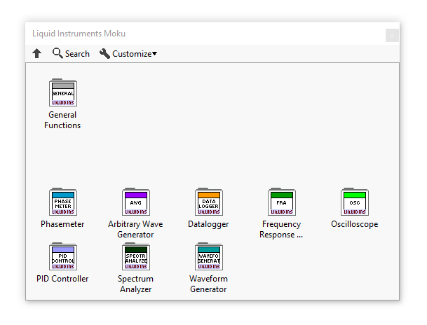
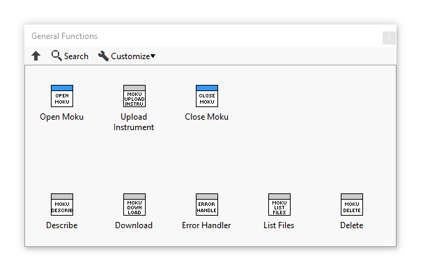
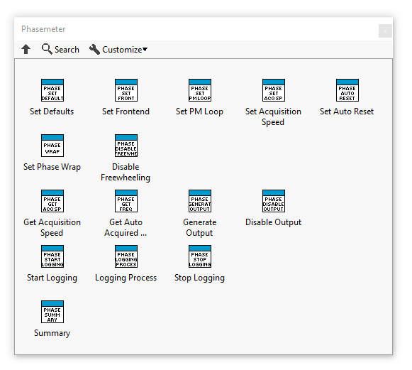
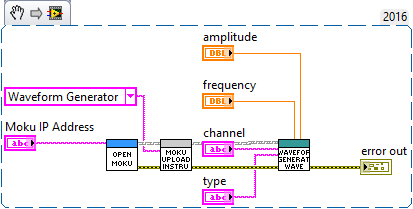
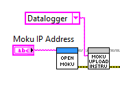
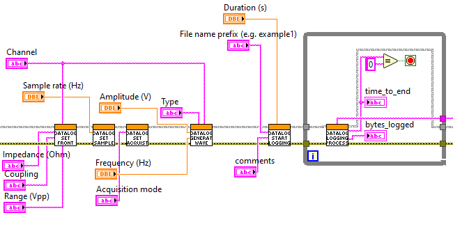
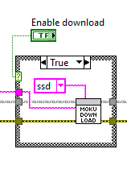
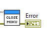
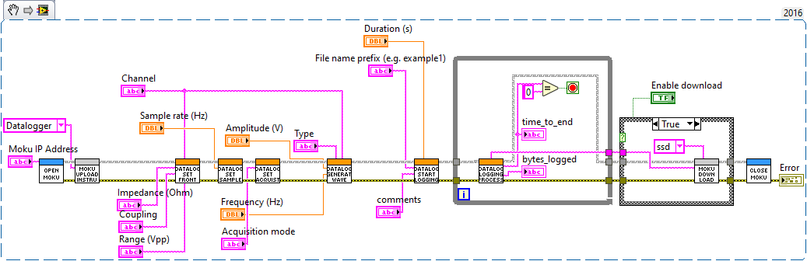

---
---
# Getting Started with LabVIEW

The Moku Scripting API for LabVIEW includes VI’s for performing Moku instrument operations, as well as examples that
demonstrate the use of these instruments through LabVIEW. This driver is in early access release only, please reach out to 
<support@liquidinstruments.com> for access to the LabVIEW Driver.

This will be an informative LabVIEW guide separated into the following parts:
- [Requirements](#requirements)
- [Installing LabVIEW Driver](#installing-labview-driver)
- [Introduction to LabVIEW Palette & Simple Example](#introduction-to-labview-palette)
- [Building your first Moku LabVIEW Project](#building-your-first-labview-moku-project)

## Requirements
- LabVIEW version 2016+
- Knowledge of your Moku's IP Address

## Installing LabVIEW Driver

### 1. Install VI Package Manager (VIPM)
VI Package Manager (VIPM) is a community and tool that manages LabVIEW Add-ons. Liquid instrument's LabVIEW Driver 
is available on VIPM. The VIPM Desktop App can be downloaded [here](https://www.vipm.io/desktop/).

### 2. Install the LabVIEW Driver
Once VIPM is installed. Please run the VI Package file provided from us and install the LabVIEW Driver. 

## Introduction to the LabVIEW Palette



After successfully installing our LabVIEW Driver. The Moku palette can be accessed under **Liquid Instruments Moku** in
LabVIEW's functions palette. The Moku palette includes a **General Functions folder** and a number of **Instrument folders**.

### 1. General Functions

The General Functions folder includes VI's for performing core Moku functions.
These include: 
- **Open Moku** - for beginning a Moku-client session 
- **Upload Instrument** - for uploading instrument data
- **Close Moku** - for ending a Moku-client session
- **Describe** - for describing the Moku's hardware, firmware and API Server version
- **Download** - for downloading files from Moku
- **List Files** - for listing files on Moku
- **Delete** - for deleting files on Moku





### 2. Instrument Functions

In each instrument folder, there exists VI's for performing functions for that instrument. Below shows an example of the
**Phasemeter** palette and all its functions.





### 3. Waveform Generator Example
To demonstrate a simple use of the LabVIEW API, we will start by building a Waveform Generator example.

First, begin a Moku-client session using **Open Moku VI**, with your Moku's IP-address as input.
Then, connect the client and error terminals to **Upload Instrument VI**. Create a constant on 
Upload Instrument VI's input terminal, and select the instrument to deploy. After that,
connect the client and error terminals to an Instrument VI to perform its function. For our example, we have 
chosen to use Waveform generator's **Generate Waveform VI**, create controls on the inputs that you would 
like to control. Finally, create an indicator on the error output so error messages can be displayed on the front panel.



This is a VI Snippet of a simple Waveform generator example, it can be used directly if you have the LabVIEW Driver installed. 
To use the snippet, right-click and save the image, then drag the image file onto your LabVIEW diagram to use.

## Building your first LabVIEW Moku project
This part of the documentation outlines useful steps for developing Moku projects on LabVIEW. The following example 
demonstrates how to use Moku's Datalogger through LabVIEW to log time-series voltage data as a binary file. Then, downloading
the file as a .li file.

The VI Snippet of the example is available [here](#_5-ready-to-run).

### 1. Begin Moku-client session
To begin your LabVIEW Moku project. First, create a client session with **Open Moku VI**, enter your Moku's IP address through the
input terminal (For details and options for finding your IP Address, see [Finding your IP Address](ip-address)).
Then, wire the VI to **Upload Instrument VI** by connecting the client and error terminals together.

Create a constant on Upload instrument VI's input terminal, and select the instrument you would like to deploy. 
For our example, "Datalogger" is selected. 




### 2. Add instrument functions
After creating a Moku-client session and deploying an instrument. We can now perform the instrument's functions.


For this example, we will configure Datalogger's **frontend**, **sample rate** and **acquisition mode**. Then,
we will **generate a waveform** on an output channel, log our time-series voltage data, while displaying our 
**logging process** on the front panel. Finally, we shall download our logged binary file. 

Similar to Open Moku and Upload instrument VI, the client and error terminals need to be connected and passed onto 
each VI. The Datalogger operations can be displayed as below:



Controls are created on the VI's so these parameters can be easily adjusted on the front panel. 
The **Datalogger Logging Process VI** has been put in a while-loop, so logging process data can be constantly updated until the logging 
completes. 


The front panel for our example is constructed as follows:


### 3. Downloading file (Optional)

The **Moku Download VI** can be added after the instrument VI's for downloading the recently logged binary file. Please save the file as ```<file_name>.li```. Then, convert the .li file to
.CSV or .MAT using our [file conversion application](https://www.liquidinstruments.com/resources/update-log/li-file-converter/).



For our example, the logged file was saved in the ssd directory. Hence, target ssd was chose for 
the Moku Download VI.

### 4. Closing Moku-client session and Error display
Finally, end the Moku-client session by using **Close Moku**, this closes the connection with your Moku and allows it to be 
connected by another client.

Please also create an indicator for the error output terminal on your final operation for displaying error messages.




### 5. Ready to run
Congratulations! You are now ready to run your first LabVIEW Moku project. We hope this is a helpful guide for our LabVIEW API!



This is a VI Snippet of the Datalogger example, it can be used directly if you have the LabVIEW Driver installed. To use the snippet, 
right-click and save the image, then drag the image file onto your LabVIEW diagram to use. 

