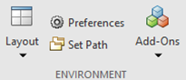
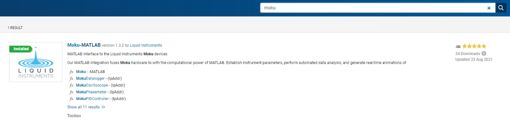
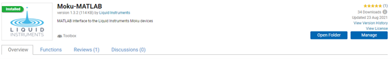
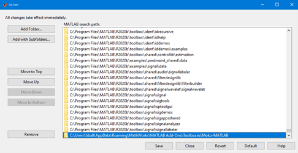
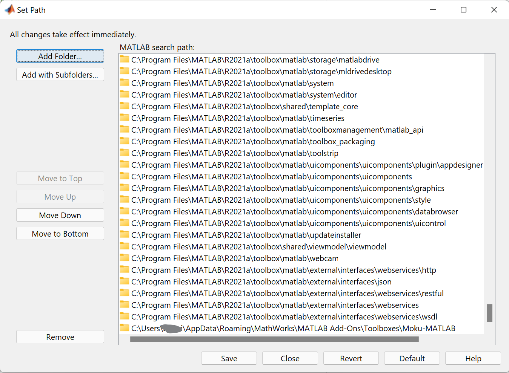
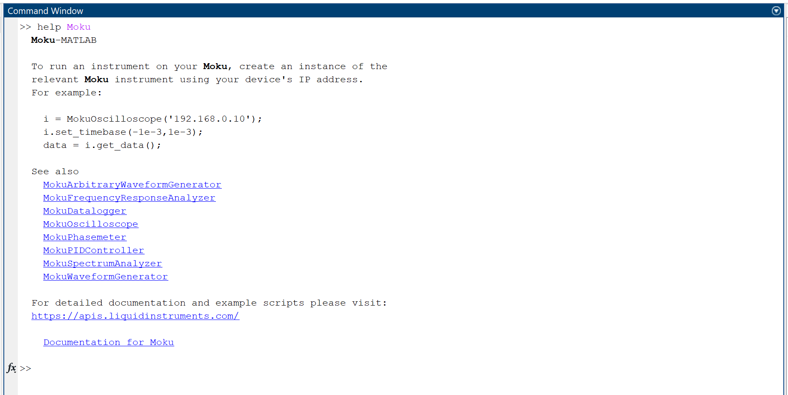

---
---
# Getting Started with MATLAB

The Moku Scripting API for MATLAB is available through the MATLAB File Exchange and the MATLAB Add-on Manager.

## 1. Install Toolbox

### Open the Add-on Manager
The Add-on Manager can be found on the Home > Environment tab.

### Search for `Moku`
The toolbox name is `Moku-MATLAB` and will generally be the only result.

### Install Toolbox
Click on the search result and select 'Add' on the right-hand side. When installation has completed, the button will change to 'Manage' and the green 'Installed' Badge will be added to the icon on the left.

### Check the Search Paths
The Moku Scripting API for MATLAB requires that it be able to access some packaged data files. Depending on your MATLAB configuration, the Toolbox path may not have been added to your file search path to facilitate this.

Select `Set Path` from the Home > Environment tab (next to the Add-On Manager).

Ensure that there is an entry pointing to the toolbox installation location. A typical path might be `C:\Users\<username>\AppData\Roaming\Mathworks\MATLAB Add-Ons\Toolboxes\Moku-MATLAB` as shown in the image below.

## 2. Test Installation

From your MATLAB Command Window, run `help Moku`. If this command succeeds, then the toolbox has been successfully installed, otherwise refer to the Troubleshooting instructions below.

## 3. Find Your IP Address
In order to connect to your Moku, you must know your device's IP Address. For full details and options, see [Finding your IP Address](ip-address.html).

## 4. Next Steps
Visit our [MATLAB Examples](/examples/matlab/) for ready-to-run scripts to get started with instruments.

For a full listing of all objects and methods, with example snippets for both Python and MATLAB, see our [API Reference](/reference/).

## Troubleshooting
#### IPv6 (including USB) Connection Issues
There are some environmental limitations when using IPv6, including using the Moku USB interface. See [this section](/ip-address.html#ipv6) for more information.
