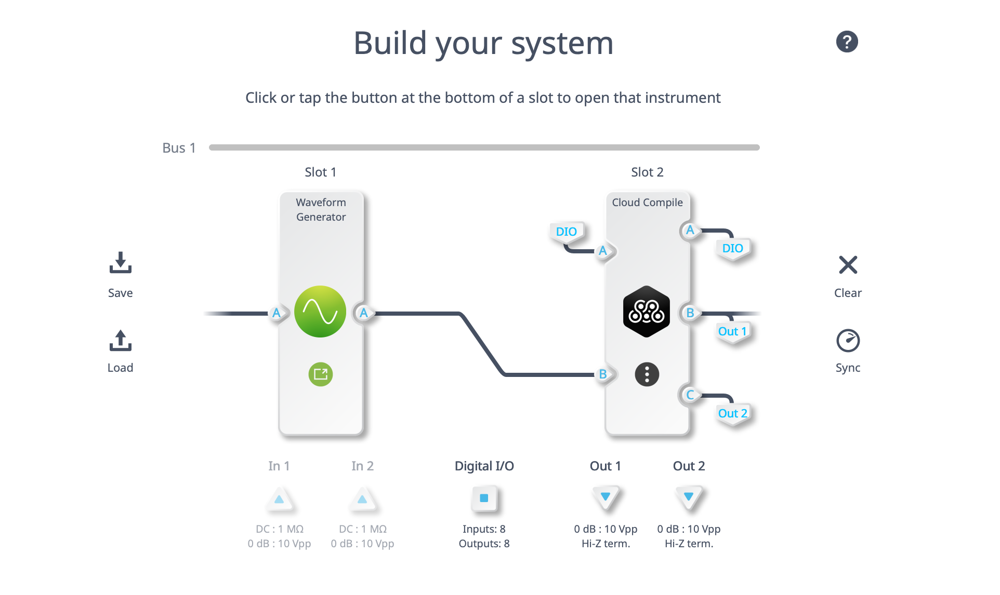
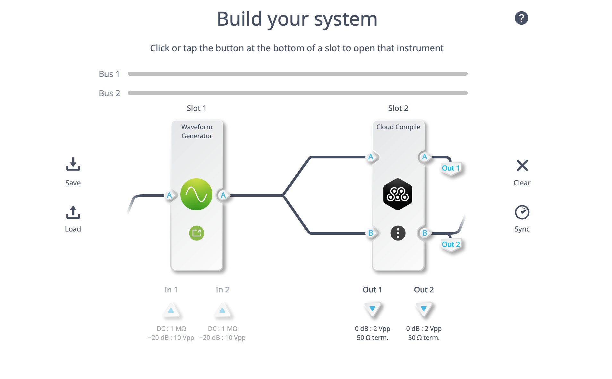
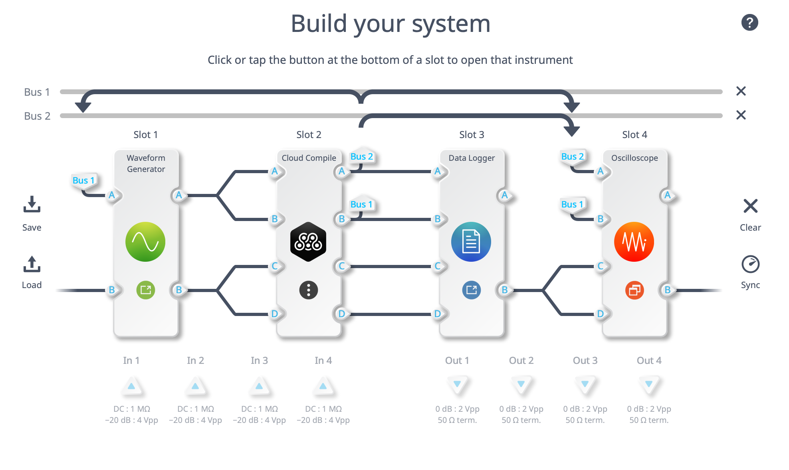
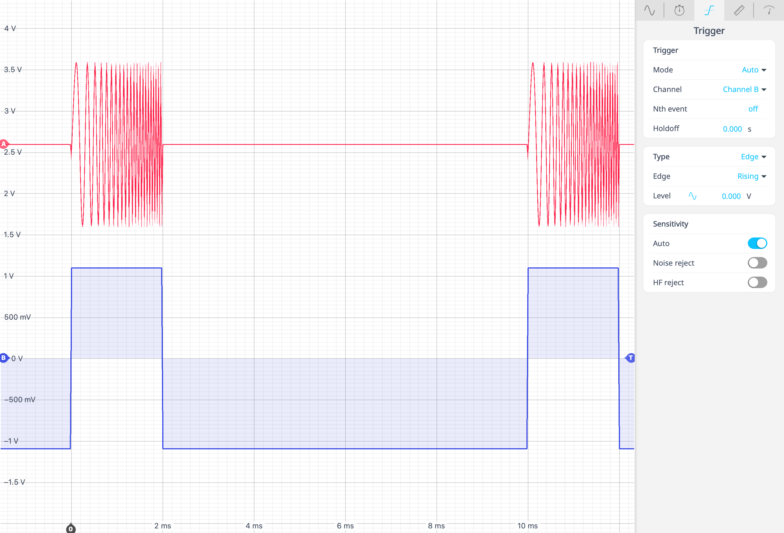

# Moku Cloud Compile Example - Swept Frequency Pulse

The example code in this directory is designed to highlight the following capabilities:

- [Python API](https://apis.liquidinstruments.com/api/) configuration with multiple Moku devices
- [Moku Cloud Compile](https://apis.liquidinstruments.com/mcc/) (MCC) design and incorporation via Multi-instrument Mode
- Python ability to load and process data logger files

## Overview
A swept frequency pulse is often referred to as a chirped pulse, and is commonly used in radar applications.  A chirped pulse is one where the transmitted frequency continuously changes (sweeps) throughout the duration of the pulse.  While the [Waveform Generator](https://liquidinstruments.com/products/integrated-instruments/waveform-generator/)  on the Moku allows for the creation of swept waveforms, it cannot by default create a chirped (swept waveform) pulse.  However, with MCC we can quite easily add this functionality into the Moku.  We will use the Moku in Multi-instrument Mode along with the Python API and MCC to demonstrate the added flexibility.  

## Included Files
The following files are included to aid with reproducing the results highlighted below.  Due to minor variations in required configuration, the appropriate files for each Moku instrument are stored in a separate folder.

### Moku:Go
Using the Moku:Go, we can use a single device to generate the swept pulse, but an additional device would be required to display the output.  The pulse timing wave will be output to channel 1 and fed back into Input A of Slot 1 to start the sweep.  The swept pulse will be output to channel 2.  The Moku:Go also has the ability to receive a reset signal and output the pulse mask to a Digital Input / Output (DIO) pin.

- **mim\_mgo\_wg\_mcc.py** will set up the Multi-instrument mode environment on the Moku:Go
- **pcMask601.tar** contains the pre-built bitstreams for the custom MCC instrument on firmware version 601 for the Moku:Go  
- **Top.vhd** designs the entity to create a variable frequency and duty cycle pulse mask that will work in conjunction with the Waveform Generator to output a swept frequency pulse
- **PulseMask.vhd** describes the behavior of the PulseMask entity

### Moku:Lab
Using the Moku:Lab, we can use a single device to generate the swept pulse, but an additional device would be required to display the output.  The pulse timing wave will be output to channel 1 and fed back into Input A of Slot 1 to start the sweep.  The swept pulse will be output to channel 2.   

- **mim\_mlab\_wg\_mcc.py** will set up the Multi-instrument mode environment on the Moku:Lab
- **pcMask601Lab.tar** contains the pre-built bitstreams for the custom MCC instrument on firmware version 601 for the Moku:Lab  
- **Top.vhd** designs the entity to create a variable frequency and duty cycle pulse mask that will work in conjunction with the Waveform Generator to output a swept frequency pulse
- **PulseMask.vhd** describes the behavior of the PulseMask entity

### Moku:Pro
Using the Moku:Pro, we can use the additional available slots to not only generate the swept pulse, but also display and record the signal.  As seen in the image below, the configuration is far more complex, viewing/recording can all be done with a single device.  The pulse could be output to one of the four Moku output channels if desired with a simple modification to the included API script. 

- **mim\_mlab\_wg\_mcc\_la\_osc.py** will set up the Multi-instrument mode environment on the Moku:Pro
- **pcMask601Pro.tar** contains the pre-built bitstreams for the custom MCC instrument on firmware version 601 for the Moku:Pro  
- **Top.vhd** designs the entity to create a variable frequency and duty cycle pulse mask that will work in conjunction with the Waveform Generator to output a swept frequency pulse
- **PulseMask.vhd** describes the behavior of the PulseMask entity

## Example Pulse
The following pulse is representative of the type of signal that would be used in a basic swept pulse system / RADAR.  The included API scripts will allow the user to specify the pulse parameters below

### Example Pulse parameters
- Starting Frequency - 1kHz
- Ending Frequency - 20kHz
- Pulse Repetition Frequency - 100Hz
- Duty Cycle - 20%

